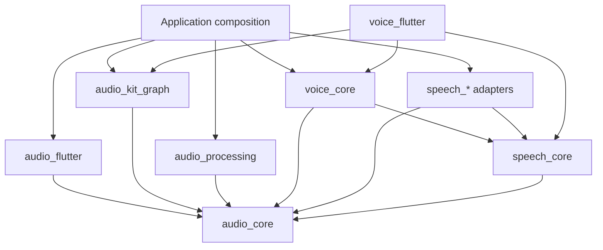

# Audio Kit for Dart

Composable, provider-neutral audio and speech building blocks for Dart and
Flutter.

This workspace owns audio transport, bounded routing, reusable processing,
speech contracts, and voice orchestration. `fluidaudio_dart` and `mlx_audio`
remain inference engines behind adapters. Packages are released independently
from this workspace so applications can compose only the layers they need.

## Packages

| Package | Responsibility |
|---|---|
| `audio_core` | Owned float32 PCM frames, immutable formats and timelines, cancellation, failures, and two-phase source/sink sessions |
| `audio_kit_graph` | `AudioHub`, dynamic N-way fan-out, independently bounded route mailboxes, overflow policies, isolation, metrics, drain, and abort |
| `audio_processing` | Stateful resampling, downmixing, rechunking, metering, explicit synchronization/mixing, in-memory WAV, and an opt-in file WAV sink |
| `speech_core` | Stable provider registry, typed descriptors/options, and streaming or batch STT, TTS, VAD, EOU, and diarization contracts |
| `audio_flutter_platform_interface` | Federated capture/playback and device-process platform messages |
| `audio_flutter` | Provider-neutral Flutter microphone/system capture, device discovery, permissions, health, and PCM playback |
| `audio_flutter_darwin` | Apple implementation with a bounded native capture pipeline, macOS process taps, playback, health, and source-native recording |
| `voice_core` | Cancellable half-duplex conversation and turn orchestration, bounded serialized synthesis, stale-generation rejection, sentence segmentation, and barge-in |
| `voice_flutter` | Graph-backed STT/VAD input and synthesized-audio output bridges, plus optional widgets driven by `voice_core` |
| `speech_fluidaudio` | FluidAudio streaming/batch STT, VAD, EOU, batch diarization, and TTS adapter |
| `speech_mlx` | MLX batch STT and incremental TTS over bounded, long-lived worker isolates |
| `speech_deepgram` | Deepgram streaming STT with renewable credentials and bounded websocket writes |
| `speech_openai_tts` | OpenAI streaming TTS exposed as a cancellable audio source |

The portable core is pure Dart. Flutter, platform-channel, native model,
network, and provider SDK dependencies remain in integration packages.

## Install and compose

Add only the packages required by the application:

```sh
flutter pub add audio_core audio_kit_graph audio_flutter speech_core
flutter pub add speech_fluidaudio
# Or choose a different provider without changing capture/routing:
flutter pub add speech_mlx
```

All packages share typed `audio_core` and `speech_core` boundaries. Capture and
routing code therefore stays unchanged when a provider adapter is replaced.
The initial public versions are released together from the same commit.

## Core guarantees

- An `AudioFrame` owns interleaved `Float32List` PCM and carries a fixed
  session format, source/track/clock IDs, sequence, sample offset, monotonic
  timestamp, and structured discontinuity.
- `AudioSource.prepare()` returns a session before delivery begins. Subscribe
  to status and frame streams, attach routes, then call `start()`.
- PCM uses `AudioFrameStream`, a single-consumer stream. Fan-out belongs in an
  `AudioRouter`. A non-pausable realtime source rejects subscription `pause()`;
  a pausable finite source applies actual source backpressure.
- Every route has independent frame-count and sample-frame bounds. A single
  unusually large frame therefore cannot bypass the memory limit.
- Realtime admission is synchronous and never waits for a Dart consumer.
  `blockUpstream` is accepted only for a source that advertises pause support.
- Ordering is guaranteed per source and route. Microphone and system audio use
  separate hubs; chronology or mixing is an explicit
  `AudioTimelineSynchronizer`/`AudioMixer` operation.
- Sink `finish()` drains accepted work, `abort()` discards it, and `close()` is
  asynchronous and idempotent. Route failures are isolated from healthy
  branches.
- Speech providers use stable string IDs, typed capabilities, models, voices,
  requests, results, and failures. Provider SDK types and dynamic payload maps
  do not enter core packages.

## Dependency direction



Capture and playback never belong to a speech provider. A provider adapter can
be changed without changing the source or router.

The reusable voice bridges preserve the same boundary:

```dart
final input = GraphVoiceInput(
  source: microphoneSource,
  streamingSpeechToText: selectedStreamingStt,
  voiceActivityDetection: selectedVad,
  recognitionOptions: selectedRecognitionOptions,
);

final output = GraphVoiceSpeechOutput(
  playbackSink: FlutterAudioPlaybackSink(),
  extraRoutes: (_) => [
    // Optional bounded recording, metering, or analysis branches.
  ],
);
```

`GraphVoiceInput` routes one capture into independent STT and VAD sessions.
When half-duplex output gates recognition, it replaces only the STT session;
capture and VAD remain active for barge-in. `GraphVoiceSpeechOutput` treats
every provider's TTS result as an ordinary finite `AudioSource`, so the same
PCM can reach playback and any additional bounded routes.

## One capture, multiple consumers

```dart
final source = FlutterAudioCaptureSource(
  FlutterAudioCaptureConfig(
    type: AudioCaptureType.microphone,
    format: AudioFormat(sampleRate: 16000, channels: 1),
  ),
);
final hub = await AudioHub.prepare(source);

final stt = await speechProvider.prepareStreamingRecognition(
  StreamingRecognitionRequest(inputFormat: hub.source.format),
);
final results = stt.results.listen(handleRecognition);

hub.attachPrepared(
  id: 'primary-stt',
  sink: stt,
  options: AudioRouteOptions.lossless(
    capacityFrames: 20,
    capacitySampleFrames: 32000,
  ),
);
await hub.attach(
  id: 'waveform',
  sink: waveformSink,
  options: AudioRouteOptions.latestOnly(
    capacitySampleFrames: 1600,
  ),
);

await hub.start(); // The source is subscribed after every route is ready.
```

For a generic file-backed recorder, import the Dart IO entrypoint separately:

```dart
import 'package:audio_processing/audio_processing_io.dart';

final recorder = WavFileAudioSink(path: '/path/to/recording.wav');
```

The normal `audio_processing.dart` entrypoint remains portable and does not
import `dart:io`.

## Current platform scope

- Core contracts and processing are portable pure Dart.
- The working Flutter backend is Apple-first: microphone capture on macOS/iOS,
  PCM playback on Darwin, and system/process capture on macOS 14.4 or newer.
- The shared Darwin plugin targets macOS 14 and iOS 17; system capture is
  availability-guarded and remains macOS-only.
- MLX inference requires Apple Silicon. Android, Windows, Linux, echo
  cancellation, and a full-duplex voice mode are not implemented yet.
- Native Fluid-specific fused routing is intentionally deferred; the generic
  Dart graph is the current correctness path.

See [architecture](docs/architecture.md), [Ectos migration](docs/migration.md),
[validation](docs/validation.md), and [releasing](docs/releasing.md) for the
complete contracts, test boundaries, and publication flow.

## Development

```sh
./tool/verify.sh
./tool/publish_dry_run.sh
```

The workspace currently targets Flutter 3.44 and Dart 3.12.

## Releases

Every package is versioned and published independently. A release tag is the
package name followed by its pubspec version, for example
`audio_core-v0.1.0`. GitHub Actions performs a clean hosted-dependency check
before publishing with pub.dev OIDC; no long-lived publishing token is stored
in GitHub.

New packages require one manual first publication. After that, configure each
pub.dev package with repository `kshdotdev/audio-kit-dart`, tag pattern
`<package>-v{{version}}`, and GitHub environment `pub.dev`.

This project is available under the [MIT License](LICENSE).
