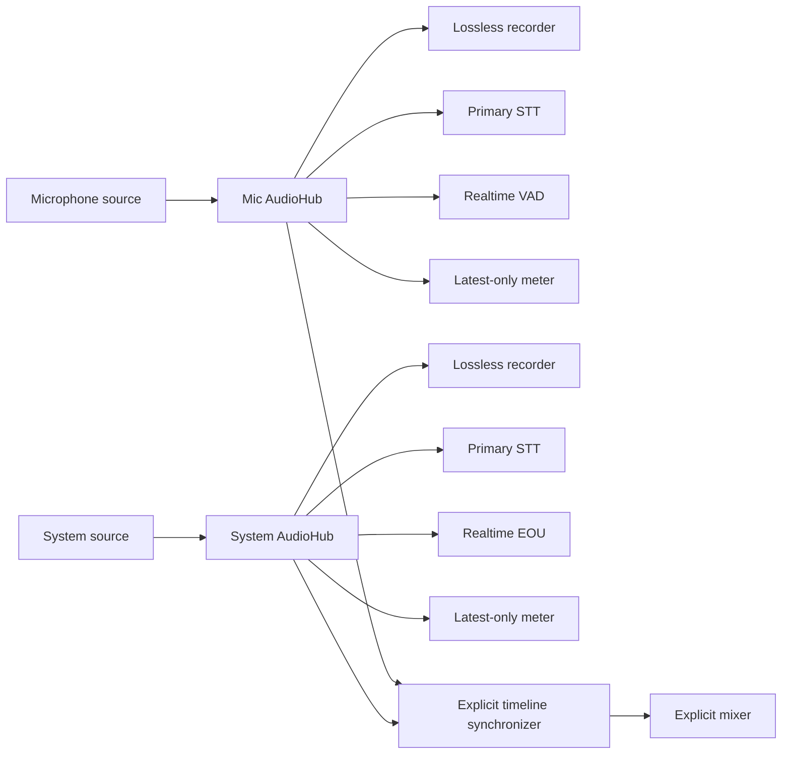
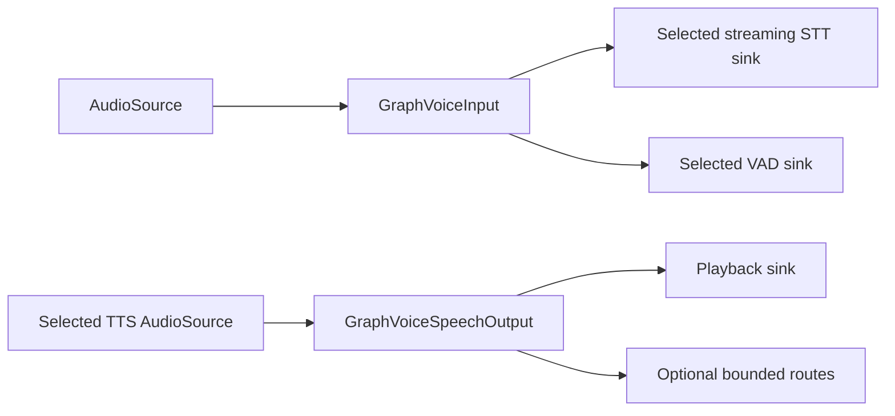

# Audio Kit architecture

## Invariants

1. Capture and playback never belong to a speech provider.
2. One session has one immutable PCM format and owned interleaved float32
   frames.
3. Sources and sinks are prepared before work starts, so listeners and routes
   exist before the first frame or health event.
4. High-rate PCM has exactly one consumer until it reaches `AudioRouter`.
5. Every live route has independent frame-count and sample-frame bounds.
   Capture callbacks never wait for Dart consumers.
6. Ordering is per source and route. Tracks stay separate until an explicit
   synchronizer or mixer is used.
7. Core packages contain no SDK types, provider enums, Riverpod objects,
   credentials, or untyped option maps.
8. Graceful finish drains accepted work; abort discards buffered work; close is
   asynchronous and idempotent.
9. Cancellation and generation IDs make late completion observable and stale
   work rejectable.

## Audio frames and source streams

`AudioFrame` contains:

- owned, interleaved float32 PCM;
- the immutable session `AudioFormat`;
- stable source, track, and clock IDs;
- monotonically increasing sequence and sample offset;
- the monotonic timestamp of its first sample frame;
- optional discontinuity metadata, including dropped frame and sample ranges.

The default constructor copies PCM. `AudioFrame.owned` takes exclusive
ownership; its caller must not mutate the list afterwards.

An `AudioSource` follows a two-phase lifecycle:

```text
prepare -> subscribe/attach -> start -> active -> stop -> finished -> close
                                          \-> abort/failed -> close
```

`AudioSourceSession.frames` is an `AudioFrameStream`, not a broadcast stream.
Its single-consumer rule prevents each listener from silently creating its own
unbounded buffer. For a realtime source such as Darwin capture,
`subscription.pause()` throws `UnsupportedError`; route it through
`AudioHub`. For a finite or synthesized source that advertises pause support,
subscription pause/resume invokes source-level backpressure before Dart pauses
delivery. Status, health, recognition-result, and other low-frequency event
streams may remain broadcast.

An `AudioSinkSession` accepts sequential writes. `finish()` waits for accepted
writes and finalization, `abort()` interrupts in-flight work where supported,
and `close()` releases resources exactly once.

## Graph and mailbox semantics



`AudioHub` owns one prepared source session and one `AudioRouter`. It subscribes
to the single PCM stream before starting the source. Routes can be attached or
detached dynamically. A sink failure terminates and cleans up only that route;
a source failure aborts the hub.

Each route mailbox is bounded twice:

- `capacityFrames` limits queued `AudioFrame` objects;
- `capacitySampleFrames` limits total queued PCM sample frames.

The bounds exclude the one frame currently being written. Metrics expose
accepted and delivered frames, delivered samples, dropped frames and samples,
current depths, high-water marks, and failures. Drop events identify the exact
sequence and sample-offset range. The next delivered frame receives merged
discontinuity metadata, preserving any discontinuity already supplied by the
source.

For non-pausable realtime sources, admission is synchronous: the graph records
accept/drop/failure immediately instead of accumulating a future chain ahead of
the mailboxes. A pausable finite source may use `blockUpstream`; concurrent
dispatch is rejected so only one backpressured add can exist.

### Overflow policies

| Consumer | Policy | Behavior |
|---|---|---|
| Source-native or graph WAV recorder | `failRoute`, and `failCapture` in native capture | Any hidden gap makes the lossless artifact invalid |
| Primary streaming STT | `failRoute` | Avoid silent transcript-state corruption |
| Optional VAD, EOU, or analysis | `dropOldest` | Keep the freshest bounded realtime window and mark a gap |
| Meter or waveform | capacity 1 plus `dropOldest` | Only the latest observation matters |
| Finite synthesis or offline input | `blockUpstream` | Wait only when the source advertises real pause support |

`dropNewest` is available when preserving already-queued history is preferable.
An oversized frame that cannot fit the sample-frame bound is dropped or fails
according to policy; it never waits forever. `blockUpstream` is rejected on a
realtime router.

## Timeline, synchronization, and mixing

Darwin microphone and process-tap frames use the shared `darwin.host-time`
clock. Separate hubs preserve independent mic/system fairness and route
failure isolation. Callback order never implies chronology.

`AudioTimelineSynchronizer` is the explicit join:

- every configured track must use the same format and clock domain;
- the first frame and discontinuities use timestamps as anchors;
- contiguous sample-offset deltas preserve exact per-track continuity;
- fixed-size output blocks contain every configured track;
- missing regions are zero-filled and marked discontinuous;
- lateness, timeline-gap, and buffered-block limits fail corrupt or runaway
  timelines before allocating an enormous silence range.

`AudioMixer` is a separate operation over synchronized blocks. This makes
alignment, zero insertion, and mixing visible choices instead of hidden router
behavior.

Stateful resampling, downmixing, rechunking, and metering maintain independent
state per track. Processing code does not merge tracks implicitly.

## WAV recording

The portable `package:audio_processing/audio_processing.dart` entrypoint
exports in-memory WAV encoding/decoding and PCM transforms.

File-backed streaming recording is intentionally isolated behind:

```dart
import 'package:audio_processing/audio_processing_io.dart';
```

`WavFileAudioSink` writes encoded chunks directly to a `RandomAccessFile` with
a bounded temporary encoding buffer. On graceful finish it patches a valid WAV
header. Its abort policy either deletes the partial file or finalizes the audio
already accepted. Timeline gaps can be rejected or handled by the configured
WAV gap policy.

Darwin capture also supports a source-native `rawRecordingPath`. That path
records the native callback format before conversion. When enabled, the native
pre-conversion queue is forced to fail-capture on overflow, so the recording
cannot silently lose callback audio.

## Provider composition

`SpeechProviderRegistry` registers implementations by stable string ID.
Provider/model/voice capabilities and adapter-specific options are typed.
Streaming STT, VAD, EOU, and streaming diarization contracts are audio sinks;
batch operations consume finite `AudioSource` values; TTS returns a cold audio
source.

| Adapter | Implemented capability | Boundary and boundedness |
|---|---|---|
| FluidAudio | Streaming and batch STT, VAD, EOU, batch diarization, TTS | Local inference; streaming ASR installs listeners before native `start`; batch collection has a configured maximum duration |
| MLX Audio | Batch-only STT and optional incremental TTS | Long-lived isolates serialize inference; admission, input PCM, and TTS output are bounded; cancellation may replace a busy isolate |
| Deepgram | Streaming STT | Renewable token source per session, typed provider options, continuity checks, and a bounded pending-audio byte queue before websocket writes |
| OpenAI | Streaming TTS | Renewable token source per synthesis, incremental PCM/WAV HTTP body decoding, a finite response-byte limit, and a pausable `AudioSource` |

MLX STT is deliberately not presented as streaming. Compose live capture with
VAD and an utterance buffer, then pass a finite source to its batch interface.
MLX TTS forwards actual incremental model callbacks before generation
completes, but its synchronous native inference source is non-pausable and
belongs behind a bounded router.

Deepgram and OpenAI never request microphone permission or own playback.
Credentials are injected and their values are redacted from diagnostics.

Changing FluidAudio streaming STT to Deepgram changes provider construction
and typed options, not capture or routing:

```text
capture source -> AudioHub -> StreamingSpeechToTextSession
                              ^ selected provider implementation
```

Changing a batch recognizer from FluidAudio to MLX similarly preserves the
finite source and request contract.

## Darwin capture transport

The Darwin implementation has two bounded native stages before Dart:


The callback copies the buffer and attempts a nonblocking enqueue into a
duration- and count-bounded `CaptureWorkRing`. Recording, persistent format
conversion, clock-gap reconciliation, and rechunking happen on a serial worker,
not the realtime callback. Converted frames enter a second bounded
`FrameMailbox`.

Dart pulls small Pigeon batches with a timeout. High-rate PCM does not travel
through an unbounded EventChannel; a separate low-frequency channel carries
health and lifecycle events. Both pre-conversion and converted-stage drops are
accounted for. The next frame reports a discontinuity, while a trailing drop
with no following frame is surfaced as an interrupted health event.

The implementation includes microphone input selection, macOS Core Audio
process taps and process targeting, one-shot silent-tap rebuild, source-native
WAV recording, bounded PCM playback, and prepare/subscribe/start ordering.
Playback exposes a bounded scheduling window so synthesized audio receives
real backpressure.

System capture requires macOS 14.4. Microphone capture and playback are shared
with iOS; system capture remains macOS-only.

## Voice lifecycle

`voice_core` keeps session and turn state separate:

| Scope | States |
|---|---|
| Session | `idle`, `preparing`, `active`, `stopping`, `failed`, `closed` |
| Turn | `idle`, `listening`, `thinking`, `speaking`, `interrupted` |

The default controller is half-duplex. It gates recognition while output is
playing but keeps capture and VAD active. VAD can therefore trigger barge-in.
Recognition resumes after the previous backend and output work has been
invalidated.

Every turn has a monotonically increasing generation ID. Interruption cancels
the backend stream and active TTS, advances the generation, discards pending
sentences, joins cancellation-insensitive old playback, and rejects stale
events before a new generation can play.

Backend narrative deltas pass through an incremental sentence segmenter.
`SerializedSynthesisQueue` synthesizes and plays sentences in order, with
independent limits for waiting sentence count and waiting character count.
Those limits exclude the one active sentence. Overflow fails with a typed,
user-safe `VoiceFailure` rather than allowing a fast backend to grow memory
without bound. Structured tool events and optional transcript transforms stay
provider-neutral.

`voice_flutter` supplies the concrete audio edges without moving provider
selection into `voice_core`:



The input borrows providers and owns only the sessions it prepares. Gating
recognition aborts and detaches the current lossless STT route; enabling it
prepares and subscribes to a fresh session before attachment. The capture and
VAD route remain active throughout. The output waits for finite-source
completion and playback drain, supports latest-play-wins interruption, and can
fan the same synthesized frames into recording, metering, or analysis sinks.

## Current limitations

- Flutter transport is Darwin-only today; Android, Windows, and Linux platform
  implementations are absent.
- System/process capture is macOS-only and requires macOS 14.4.
- MLX inference is Apple-Silicon-only.
- Native capture restart/drop metadata currently reaches Dart as a dropped
  range; a distinct native `sourceRestart` reason is not transported yet.
- The default voice controller is half-duplex with VAD barge-in. Full-duplex
  acoustic echo cancellation is future work.
- The graph is implemented in Dart. FluidAudio-specific fused native routing
  is deferred until profiling justifies it.
- All packages are published to pub.dev and consumed hosted by Ectos
  (no path dependencies).

See [validation](validation.md) for what the default test suite does and does
not exercise.
