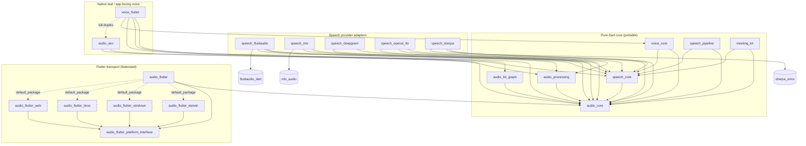
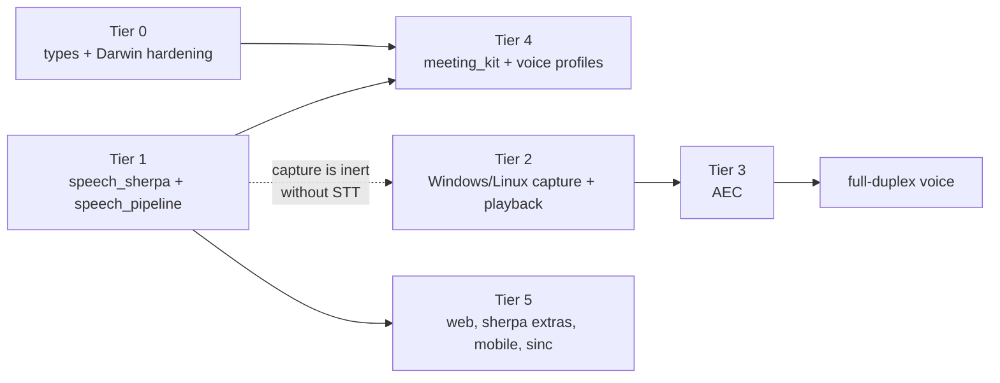

# The Complete Audio SDK — Control Center parity analysis and roadmap

*Errata: this document is a historical analysis, preserved as written. The intelligence packages it proposes and places under `packages/` — `speech_pipeline`, `turn_detection`, `transcript_kit`, `meeting_kit`, and `conversation_core` — were built and then split out into the sibling [conversation-kit-dart](https://github.com/kshdotdev/conversation-kit-dart) repository. Package paths and tier groupings below still describe the single-repo layout that existed at the time of writing. One placement below was also revised in the build: the voice-profile matcher this document puts in `speech_core` (`VoiceProfile`, `bestVoiceMatch`, `suggestedNames`, `blendCentroid`, `unblendCentroid`) shipped there pre-release and then moved to `transcript_kit`, because recognizing a voice across meetings is intelligence-layer policy rather than a provider contract. `speech_core` keeps the half an adapter has to produce — `SpeakerEmbedding`, `speakerSimilarity`, `l2NormalizeVector` — which is the type-level fix this section argues for and is unaffected.*

> Produced 2026-07-28 by a multi-agent analysis (three exploration agents, one design agent, five section authors, two verification agents) over five repos. Section-level claims are cited to source; see the reading guide below for conventions.

## Executive summary

Audio Kit is already the better *architecture*: a typed provider registry, a bounded fan-out graph, streaming ASR, on-device EOU turn detection, TTS with voice cloning, and ITN — none of which Control Center has. Control Center is the better *product platform*: it captures system audio on four platforms, cancels echo with production WebRTC AEC3, transcribes anywhere via sherpa-onnx, diarizes, and remembers who spoke across meetings. This document maps the delta and sequences the work that closes it.

**The five headline findings:**

1. **The gap is narrower than the old comparison docs claimed.** sherpa-onnx has a first-party Flutter binding (`sherpa_onnx ^1.13.4`) covering Windows, Linux, macOS, iOS, and Android — the "cross-platform ML is a new engine" wall is now one adapter package (`speech_sherpa`). It even exports a streaming `OnlineRecognizer` (Control Center's batch-only stance was a choice), and public ONNX turn-detection models (smart-turn-v3, 8 MB) mean even EOU is not Apple-locked in principle.
2. **AEC is the defining gap.** Audio Kit has zero echo cancellation at any layer — the one acknowledged correctness hole when meetings play through speakers. Control Center's three-part solution (AEC3 FFI shim + envelope cross-correlation delay estimator + fail-safe stream orchestration) is the reference design, and most of it is pure Dart that lifts nearly verbatim.
3. **Capture parity is a lift, not a research project.** Control Center's `system_audio_capture` package is self-contained and MIT-licensed: 765 lines of complete WASAPI loopback for Windows, a pure-Dart PulseAudio/PipeWire path for Linux, and web `getDisplayMedia` — all adaptable behind Audio Kit's existing pull-model platform interface. **Attribution required: Control Center is MIT © Samuel Alev, not Kauan's code** (the older docs' contrary claim is false).
4. **The biggest Audio Kit lever is wiring, not code.** Diarization, VAD, TTS, playback, metering, mixing, and the entire voice layer are implemented, tested, published — and unreachable from the consuming app. Speaker embeddings exist one layer down and are structurally dropped at the adapter boundary (`speech_fluidaudio`), which single-handedly blocks all cross-meeting speaker identity.
5. **This analysis found three real bugs in Audio Kit's own Darwin plugin** by comparing it against Control Center's hard-won fixes: no App Nap guard (capture buffers-and-bursts when unfocused), no clock device on the tap aggregate (silent-capture failure Control Center hit on macOS 26 + USB output), and a permission preflight that likely reports `true` for an unauthorized tap that will deliver only silence.

**The strategy in one paragraph:** keep FluidAudio as the premium Apple path (the only on-device streaming + EOU + TTS), add `speech_sherpa` as the universal inference floor, lift Control Center's capture and AEC natives with attribution, add the thin pure-Dart layers Control Center proved out (window cutter, hallucination filters, echo dedup, voice-profile math, meeting lifecycle), and deliberately skip its client/server split, base64 transport, and DAG engine. No BlackHole, no virtual devices — process taps and WASAPI loopback are the modern driver-free path.

**Tiers at a glance:** T0 unblock types + Darwin capture hardening (S) → T1 cross-platform inference: `speech_sherpa` + `speech_pipeline` (L+M) → T2 Windows/Linux capture **and playback** (L+S/M+S) → T3 AEC (M+L+M, prototype native distribution first) → T4 meeting kit + voice profiles (M+S+M) → T5 web, sherpa extras, cross-platform EOU, mobile capture.

---

## Context and reading guide

Audio Kit today is a macOS/iOS SDK: 13 published packages (v0.1.0), a clean layered architecture, 211/211 tests — and a transport layer that only exists on Darwin. Control Center is the reference point: a working client/server meeting app whose capture layer spans **macOS, Windows, Linux, and web**, with production acoustic echo cancellation, server-side sherpa-onnx inference, diarization, and cross-meeting voice profiles.

This document is the parity analysis between the two, and the roadmap that turns Audio Kit into the complete, provider-pluggable, cross-platform audio SDK a rebuilt Control-Center-class app would sit on — using Kauan's own stack (FluidAudio on Apple, MLX on Apple Silicon, sherpa-onnx everywhere, cloud providers as fallbacks).

### The two reference implementations

| | Audio Kit + ectos | Control Center |
|---|---|---|
| Author | Kauan Guesser (MIT) | Samuel Alev (MIT) — **not Kauan's code; lifted code requires attribution** |
| Where ML runs | in-process, on-device (CoreML/ANE via fluidaudio_dart; MLX via FFI) | local `cc_server` child process, ONNX Runtime CPU (sherpa-onnx) |
| Capture platforms | macOS 14+ / iOS 17+ (system audio macOS 14.4+) | macOS 14.4+, Windows 10 1703+, Linux (PulseAudio/PipeWire), web |
| Boundary format | float32 LE, 16 kHz mono, zero-copy in-process | PCM16 LE, 16 kHz mono, base64 in JSON-RPC |
| Live transcription | streaming ASR (volatile → confirmed) | batch ASR over VAD-cut rolling windows |
| Echo strategy | structural avoidance (strict track separation) | WebRTC AEC3 + text-level dedup |
| Post-meeting | none (transcript discarded) | diarization → speaker ID → structured summary → persistence |

Scope note: **mobile capture (iOS/Android) is deliberately out of scope.** Neither reference implementation captures audio on a phone, so there is nothing to lift and no field-proven mechanism to describe. Inference on mobile is covered — `sherpa_onnx` ships iOS and Android platform packages — but the capture layer for those platforms would be net-new research and is listed only as a Tier 5 possibility.

### Contents

| Part | Section | What it covers |
|---|---|---|
| 1 | Executive summary | The five headline findings and the strategy in a paragraph |
| 2 | Context and reading guide | The two reference implementations, path tags, conventions, snapshot |
| 3 | Capture and platform coverage | Per-platform state, the capture contract as invariants, lift plans for Windows/Linux/web |
| 4 | Signal processing and echo cancellation | The AEC gap, Control Center's three-part reference design, VAD, hallucination filters, DSP parity |
| 5 | Speech providers, models, and inference | Provider matrix, per-provider deep dives, `speech_sherpa` and `speech_pipeline` designs, model storage |
| 6 | Contracts and package topology | Target package graph, `speech_core`/`audio_core` contract diffs, federation and conformance |
| 7 | The meeting layer | Detection fusion, lifecycle, voice profiles, post-meeting pipeline, live-assist hooks |
| 8 | The roadmap | Six tiers with efforts and dependencies, what not to build, the risk register |

### Repo map and path tags

Citations use `TAG://relative/path:lines`, where `lines` is a single line (`:229`), a range (`:78-88`), or a comma-separated list of either (`:85,170,190`):

| Tag | Repo | Location |
|---|---|---|
| `AK://` | audio-kit-dart (this repo) | `/Users/kauan/Projects/kshdotdev/audio-kit-dart` |
| `FA://` | fluidaudio_dart 0.3.1 | `/Users/kauan/Projects/kshdotdev/fluidaudio-dart` |
| `MLX://` | mlx / mlx_audio | `/Users/kauan/Projects/kshdotdev/mlx` |
| `CC://` | Control Center (reference) | `/Users/kauan/Projects/ectos/references/control-center` |
| `E://` | ectos app (consumer) | `/Users/kauan/Projects/kshdotdev/flutter-app` |

Claims verified against source during this analysis carry a citation; claims carried from earlier analysis but not re-read are marked with a trailing `~`; open questions are marked **TO-VERIFY**. Risk identifiers (`R1`–`R13`) referenced throughout are defined in the risk register at the end of the final section. The older ectos ↔ Control Center comparison corpus at `/Users/kauan/Projects/ectos/docs/` (verified 2026-07-22) remains the deep reference for the two *apps*; this document is about the *SDK*.

Two terms recur and are worth fixing now: **`me`** is the local microphone track and **`them`** is the system/remote track. Both reference implementations keep them as two independent streams end to end and never mix them before ASR — that separation is what makes the transcript speaker-attributed for free, and it is the precondition for the one-directional echo filter described later.

### Snapshot

| Component | Version at analysis (2026-07-28) |
|---|---|
| audio-kit-dart | 0.1.0 (all 13 packages on pub.dev) |
| fluidaudio_dart | 0.3.1 (wraps FluidAudio 0.15.x) |
| mlx / mlx_audio | 0.1.0 / 0.2.0 |
| ectos app | consumes hosted ^0.1.0 / ^0.3.1 |
| Control Center | initial commit `b555085`, schema v48 |

---

## Capture and platform coverage

Capture is where the SDK's ambition and its reality diverge most sharply. On macOS, `audio_flutter_darwin` is a peer of Control Center's capture plugin and better than it in two respects. Everywhere else, the SDK has a federated seam and a throwing stub. This section establishes what the Darwin implementation already proves, fixes the capture contract as a set of invariants every future platform owes, and lays out the lift plan for Windows, Linux, and web.

Everything lifted from Control Center in this section is MIT © 2026 Samuel Alev and carries an attribution obligation; the normative statement and the per-package NOTICE table live in the contracts section.

### 1. Current state per platform

| Platform | System audio | Microphone | Enumeration | Permission | Status |
|---|---|---|---|---|---|
| macOS | Core Audio process taps, 14.4+ (`AK://packages/audio_flutter_darwin/darwin/audio_flutter_darwin/Sources/audio_flutter_darwin/SystemAudioCapture.swift`) | `AVAudioEngine` input tap (`MicrophoneCapture.swift`) | processes + input devices | system-audio preflight only | **parity or better** |
| iOS | n/a (taps are macOS-only) | `AVAudioEngine` | input devices | — | partial |
| Windows | `_UnsupportedAudioFlutterPlatform` → throws | throws | `[]` | `false` | **absent** |
| Linux | throws | throws | `[]` | `false` | **absent** |
| Web | throws | throws | `[]` | `false` | **absent** |
| Android | — | — | — | — | **out of scope** (no reference implementation to lift; inference is covered by `speech_sherpa`) |

The non-Darwin story is a single class: `_UnsupportedAudioFlutterPlatform` is the default instance, returning `false`/`[]` for capability queries and throwing `UnsupportedError` for every operation (`AK://packages/audio_flutter_platform_interface/lib/src/audio_flutter_platform.dart:76-140`). The federated seam is correctly shaped; it simply has one implementation.

#### macOS: where audio-kit leads

Both stacks converged on the same process-tap sequence, independently, including the same hard-won gotchas. Three points where `audio_flutter_darwin` is the better citizen:

**Permission on the documented surface.** Control Center reaches `kTCCServiceAudioCapture` by `dlopen`-ing `/System/Library/PrivateFrameworks/TCC.framework/TCC` and calling `TCCAccessPreflight`/`TCCAccessRequest` through `unsafeBitCast` (`CC://packages/system_audio_capture/macos/Classes/SystemAudioCapturePlugin.swift:187-234`) `~`. `audio_flutter_darwin` uses a throwaway tap instead: build a `CATapDescription`, attempt `AudioHardwareCreateProcessTap`, destroy it, report the result (`AK://.../SystemAudioCapture.swift:643-659`). Grepping the whole Darwin source tree for `TCC` and `dlopen` returns nothing — verified this pass. For a package published to pub.dev this distinction is not stylistic. Private-framework `dlopen` is an App Store rejection risk and a "breaks on the next OS point release" risk that every downstream consumer would inherit without consenting to it.

**Two bounded native stages.** `CaptureWorkRing` (241 lines) and `FrameMailbox` (260 lines) split the realtime callback from the conversion work: the IO proc copies and enqueues without blocking, a serial worker drains it to record/convert/rechunk. Control Center's macOS plugin converts inside the IO proc and marshals frames to the main thread because the macOS embedder crashes when registering a background task queue (`CC://.../SystemAudioCapturePlugin.swift:116-123`) `~`. audio-kit's structure is the one to generalize (§2).

**Dedicated queues, correctly.** `ioQueue` and `workerQueue` are distinct, both `.userInitiated` (`AK://.../SystemAudioCapture.swift:18-25`), and `AudioDeviceCreateIOProcIDWithBlock` is given a real queue (`:277`) — never `nil`, the failure mode where the HAL silently never schedules the proc.

Watchdog parity is close and audio-kit's is slightly richer: a 2 s `Task` checks whether audio advanced, emits a `rebuilding` notice, performs a one-shot rebuild against a fresh PID translation, waits another 2 s, and only then fails with `SystemCaptureDead` (`AK://.../SystemAudioCapture.swift:98-155`). Control Center's 2 s watchdog reports `no_io_frames`/`io_no_output` as a stream error and lets the recorder decide (`CC://.../SystemAudioCapturePlugin.swift:509-536`) `~`. Both read the tap's real format from `kAudioTapPropertyFormat` rather than assuming 48 kHz stereo float (`AK://.../SystemAudioCapture.swift:530`), and neither touches `isExclusive` — verified absent from the audio-kit source this pass.

#### Two macOS gaps found while verifying

**No aggregate clock device.** audio-kit builds its private aggregate with `Name`, `UID`, `IsPrivate`, `TapAutoStart`, and `TapList` (`AK://.../SystemAudioCapture.swift:225-234`). It does **not** set `kAudioAggregateDeviceClockDeviceKey` or `kAudioAggregateDeviceMainSubDeviceKey`. Control Center sets both, clocking the aggregate off the current default output device, after observing that a tap-only aggregate never clocked on macOS 26 with a USB output device (`CC://.../SystemAudioCapturePlugin.swift:415-449`) `~`. audio-kit substitutes `TapAutoStart`, which is a different mechanism (it starts the tap; it does not supply a clock source). This is a latent hardware-dependent silent-capture bug, and the 2 s watchdog would surface it as `SystemCaptureDead` rather than as "your USB DAC needs a clock device" — a confusing failure for the exact users most likely to hit it. **Recommend adopting CC's clock-device keys.** This is a small, high-value fix and belongs in Tier 0, not in the Windows tier.

**The permission preflight may be unsound.** `preflightPermission()` returns `true` whenever `AudioHardwareCreateProcessTap` succeeds (`AK://.../SystemAudioCapture.swift:643-659`, read this pass). Control Center's source documents the opposite property: an unauthorized tap **creates successfully and reports a valid format, but is fed silence**, so permission cannot be inferred from creation success (`CC://.../SystemAudioCapturePlugin.swift:26-30`) `~`. If that holds on current macOS, audio-kit's permission API can return a false positive, and the watchdog — not the permission call — is the real authorization detector. The graceful degradation is intact either way; the API contract is what's misleading. **TO-VERIFY:** whether tap creation fails or succeeds-silently under a denied `kTCCServiceAudioCapture` grant on macOS 15/26. If it succeeds-silently, either document `requestSystemAudioCapturePermission` as advisory or gate it on observing non-silent frames.

Both codebases also share the TCC-grant-keyed-to-cdhash tax: an unstable signing identity re-prompts on every build `~`. That is a dev-loop footnote to document, not a defect to fix.

### 2. The capture contract, as invariants

Everything a new platform implementation must satisfy, stated once.

**Pull, not push.** The platform boundary is `readCaptureFrames(sessionId, {maxFrames = 8, timeout = 500ms}) → PlatformAudioFrameBatch` (`AK://packages/audio_flutter_platform_interface/lib/src/audio_flutter_platform.dart:29-34`). Control Center pushes `Stream<Uint8List>` over an EventChannel and then rebuilds the properties a pull model gives away: a per-channel monotonic `seq` plus a serial `Future` chain so arrival order equals capture order and the sender feels backpressure (`CC://packages/cc_data/lib/src/repositories/rpc_meeting_recording_control.dart` and the recorder controller) `~`. Under a pull model, backpressure is structural — the consumer's read rate *is* the flow-control signal, ordering is trivially preserved, and there is no need to marshal frames onto a UI thread just to hand them to Dart. Every platform pays for this with a bounded native ring drained on read. That is real work, not a shim, and the Darwin `CaptureWorkRing` + `FrameMailbox` pair is the reference implementation.

**Float32, 16 kHz, mono, canonical.** `AudioSampleFormat` has exactly one member, `float32` (`AK://packages/audio_core/lib/src/format.dart`). Every backend converts to it at the native edge. Conversion to int16 happens at exactly three places downstream: the AEC3 FFI call, WAV writing, and any provider that demands PCM16. This costs a cheap conversion at 16 kHz mono and saves doubling every branch in the graph and processing layers.

**Health is a phase, not a boolean.** `FlutterAudioCaptureHealthPhase{prepared, starting, running, interrupted, stopping, stopped, failed}` `~`, with the underlying capture free to report a silent-then-rebuilt transition. A platform that can create a capture handle successfully and then deliver nothing — which is *all three* desktop platforms, for different reasons — must have a watchdog and must say so through this channel rather than hanging.

**Bounded everywhere, drop deliberately.** No unbounded native queue; overflow resolves through the declared `AudioOverflowPolicy` rather than by growing memory. Discontinuities are reported, not hidden.

**Session lifecycle.** `prepare → start → (read)* → stop|abort → dispose`, all keyed by `sessionId`. Control Center's plugin has no equivalent — `capture()`/`stop()` is the whole surface (`CC://packages/system_audio_capture/lib/system_audio_capture.dart:83-190`) `~` — so every lift owes this scaffolding on top of the DSP it inherits.

### 3. `audio_flutter_windows` (Tier 2, effort L)

Control Center's Windows backend is 765 lines of complete WASAPI shared-mode loopback — more code than its macOS backend, and the single most valuable artifact available for lifting (`CC://packages/system_audio_capture/windows/system_audio_capture_plugin.cpp`) `~`.

**Lifts near-verbatim** — the DSP and Win32 plumbing, which is correct and hard-won:

| Piece | Detail | Cite `~` |
|---|---|---|
| Loopback init | `IAudioClient::Initialize(SHARED, AUDCLNT_STREAMFLAGS_LOOPBACK, 200 ms, mixFormat)` | `:628-635` |
| Format decode | IEEE float32 + int 8/16/24/32, with 24-bit sign extension and unsigned-8 centering | `:100-151` |
| Mono downmix | average all channels per frame (`ReadMonoSample`) | `:100-151` |
| Resampler | `LinearResampler` carrying fractional cursor + previous sample **across packet seams** | `:175-238` |
| Thread priority | dedicated thread, `CoInitializeEx(COINIT_MULTITHREADED)`, MMCSS "Pro Audio" | `:674` |
| Poll cadence | sleep = half buffer, clamped [5, 100] ms, sliced at 5 ms so stop latency is bounded | `:678-682, 752-759` |
| Silence flag | `AUDCLNT_BUFFERFLAGS_SILENT` → emit zeros so timing stays correct | `:710-712` |
| Enumeration | `IMMDeviceEnumerator::EnumAudioEndpoints(eRender, ACTIVE)` + `PKEY_Device_FriendlyName` | `:415-499` |
| Build hazard | `functiondiscoverykeys_devpkey.h` must follow `mmdeviceapi.h` on SDK 10.0.26100+ | `:7-19` |

The cross-seam fractional cursor deserves emphasis: it is the difference between a clean resample and periodic clicks at every packet boundary, and it is the kind of detail that costs a day to rediscover. CC's own comment flags linear interpolation as a deliberate floor with windowed-sinc as the next step (`:159-174`) `~` — matching audio-kit's Dart `AudioResampler`, which is also linear (`AK://packages/audio_processing/lib/src/resampler.dart:7`). Keep the parity; upgrade both together later or neither.

**Must be reworked:**

- **Push → pull.** Delete the `WM_USER + 0x301` window-message marshalling to the Flutter view's HWND (`:289-345`) `~` entirely. It exists only to hand frames to an EventChannel on the platform thread. Replace with a mutex-guarded bounded ring that the capture thread writes and `readCaptureFrames` drains. This is a *simplification* — the pull model deletes a whole Win32 mechanism.
- **PCM16 → float32** at the native edge, per §2.
- **Session lifecycle** — `prepare/start/stop/abort/dispose` keyed by `sessionId`, plus health-phase events and a watchdog. CC has none of this.
- **Microphone in-plugin.** Implement WASAPI `eCapture` alongside the loopback rather than depending on `package:record`. Three reasons: one device model instead of two; one permission story; and it keeps the mic-DSP invariant (§7) under SDK control rather than exposed as third-party config flags that a contributor can flip and silently break the AEC reference path.

Windows needs no permission gate for shared-mode loopback — CC's `requestPermission` returns `true` unconditionally (`:371-376`) `~`. Report that honestly through the platform interface rather than pretending a prompt occurred.

**Playback is in scope, and Control Center is no help here.** The platform interface declares seven playback methods alongside the capture set — `preparePlayback`, `playbackEvents`, `startPlayback`, `writePlaybackFrames`, `finishPlayback`, `abortPlayback`, `disposePlayback` (`AK://packages/audio_flutter_platform_interface/lib/src/audio_flutter_platform.dart:50-67`) — and all seven throw on non-Darwin today. A Windows build that implements only capture silently loses `FlutterAudioPlaybackSink`, every TTS output path, the whole `voice_flutter` layer, and meeting playback, on the exact platform the roadmap is targeting. CC captures only and plays back through `audioplayers`, so there is nothing to lift: this is net-new work against `IAudioClient` in **render** mode (`eRender`, shared mode, `GetBufferSize`/`GetCurrentPadding`/`ReleaseBuffer`), fed by `writePlaybackFrames` with the same bounded-ring discipline inverted — the Dart side pushes, the render thread drains. Budget it as part of the Windows package rather than discovering it when the first TTS call throws.

### 4. `audio_flutter_linux` (Tier 2, effort S — the cheapest win in the plan)

Control Center implements Linux with **no native code at all**: spawn `parecord --raw --rate=16000 --channels=1 --format=s16le --device=<target>`, falling back to `pw-record` (`CC://packages/system_audio_capture/lib/system_audio_capture.dart:238-316`) `~`. Target resolution takes an explicit `.monitor` id, else `pactl get-default-sink` → `<sink>.monitor`. Enumeration is `pactl list sources short` filtered to `.monitor` entries. `isSupported()` is binary presence. `stderr` must be drained or the pipe blocks the child.

The whole implementation registers via `dartPluginClass`, so no C++, no CMake, and `audio_flutter` stays clean. Microphone is the identical code path pointed at the default *source* instead of the monitor. Rework is limited to the same three items as Windows: PCM16→float32, the ring/pull adapter (here a Dart-side bounded buffer over the child's stdout), and session lifecycle. The watchdog matters as much as elsewhere — a missing `parecord`, a PipeWire session without the pulse shim, or a wrong monitor name all produce "process started, no bytes."

**Playback**, as on Windows, is not in CC's plugin and must be added: the symmetric answer is spawning `paplay --raw --rate=16000 --channels=1 --format=s16le` (or `pw-play`) and writing frames to its stdin, which keeps the package pure Dart end to end. If latency or device selection proves inadequate through the process boundary, the fallback is an ALSA/PulseAudio FFI binding — which would cost Linux its "no native code" property and move it out of the S bracket. That contingency is the main reason the Linux estimate is a range rather than a number.

Highest value per hour in the entire roadmap: an entire desktop platform for roughly the cost of a careful afternoon plus tests, assuming the process-spawn playback path holds.

### 5. `audio_flutter_web` (Tier 5, effort M, optional)

`getUserMedia` for mic, `getDisplayMedia({audio: true, video: true})` for system audio. Carry over Control Center's UX findings verbatim, because they are browser-behavior facts rather than design choices (`CC://lib/features/meetings/data/web/web_audio_capture.dart`) `~`:

- The **video track must be requested and kept alive but never consumed** — browsers will not grant tab/system audio without it (`:76-89`).
- **Hard-fail with an actionable message** when the user shares a surface without ticking "share audio"; name Safari, Firefox, and macOS full-screen sharing as known failures (`:91-100`). These are not fixable from the SDK.
- Route through a **muted `GainNode` → destination** so the processing node actually fires without echoing playback to the speakers (`:108-118`).

**Diverge on one point:** use `AudioWorklet`, not `ScriptProcessorNode(4096, 1, 1)`. CC uses the deprecated node and its own source names AudioWorklet as the documented follow-up (`:13-17`) `~`. A worklet plus a pull model needs a ring buffer between the audio thread and the main thread; if that ring is a `SharedArrayBuffer`, the embedding page needs COOP/COEP headers — a deployment constraint to state up front (risk R8).

**Playback** on web is the one platform where it is nearly free: an `AudioWorkletNode` (or `AudioBufferSourceNode` for non-incremental output) fed from `writePlaybackFrames` and connected to the context destination. The same worklet infrastructure the capture path needs serves both directions.

**The AEC inversion.** On desktop the mic must be captured dry and echo cancelled in software (§7). On web there is no AEC3, so the browser's own AEC is the only option: CC requests `echoCancellation: true, noiseSuppression: true, autoGainControl: false` on web (`CC://lib/features/meetings/data/web/web_audio_capture.dart:56-70`) `~` against all-off on desktop (`CC://lib/features/meetings/presentation/notifiers/meeting_recorder_controller_io.dart:56-63`) `~`. The SDK should encode this as a platform-conditional policy with the reason attached, not as a config default a caller might "normalize" across platforms.

### 6. Platform-interface additions

**Microphone permission — a real gap.** There is no mic permission method on the interface, and grepping the entire Darwin source tree for `AVCaptureDevice`, `requestAccess`, `authorizationStatus`, and `requestRecordPermission` returns nothing (verified this pass). Permission is implicit via `Info.plist`, which means the first `AVAudioEngine` start triggers the OS prompt with no way for an app to check or request ahead of time — and `AK://packages/audio_flutter/README.md` claims permission support `~`. Add `hasMicrophonePermission()` and `requestMicrophonePermission()`, implemented per platform (`AVCaptureDevice.requestAccess(for: .audio)` on Darwin; no-op `true` on Windows/Linux; `getUserMedia` probe on web).

**Generalize enumeration.** Today the interface exposes `listAudioInputDevices()` and `listAudioProcesses()` (`:46-48`) — the second being macOS-specific vocabulary. Windows enumerates render *endpoints*; Linux enumerates *monitor sources*. Adopt Control Center's source-kind model — `system` / `process` / `monitor` / `unknown` (`CC://packages/system_audio_capture/lib/system_audio_capture.dart`) `~` — as `listCaptureSources()`, keeping `listAudioInputDevices()` for mic devices. Note the cautionary tale attached: CC implements `listSources()` on all three desktop platforms and **no UI ever calls it**; `sourceId` is always null `~`. Ship the enumeration API together with the thing that consumes it, or it becomes more built-but-unwired surface (risk R12).

The *request* side needs the same treatment: `PlatformCaptureRequest.processIds` is a `List<int>`, which cannot name a WASAPI endpoint or a PulseAudio monitor. The contracts section specifies the `sourceId` addition that makes targeted capture expressible off macOS.

### 7. SDK invariants

**The six macOS process-tap rules** — both codebases arrived at these independently; treat them as settled:

1. Fresh `CATapDescription` per session, `muteBehavior = .unmuted`; global-except-self or targeted PIDs.
2. **Never set `isExclusive`** — it flips global-tap semantics and yields silence.
3. **Read the tap's real ASBD** from `kAudioTapPropertyFormat`; never assume 48 kHz stereo float. CC observed a 9-channel buffer from a Voice-Processing path `~`.
4. Create a **private aggregate device** referencing the tap UUID, **clocked by the current default output device** — see the §1 gap; audio-kit does not do the clocking half today.
5. `AudioDeviceCreateIOProcIDWithBlock` on a **dedicated dispatch queue**, never `nil`.
6. **A ~2 s watchdog is mandatory** — a tap can be created successfully and never deliver a frame. Rebuild once before declaring death.

**The mic-DSP invariant: capture dry, cancel in software.** On macOS, enabling echo cancellation *or* AGC on the microphone switches it to Voice-Processing I/O, which produced a dead mic *and* reconfigured/ducked the output device the tap clocks — killing **both** channels (`CC://lib/features/meetings/presentation/notifiers/meeting_recorder_controller_io.dart:47-63`) `~`. Control Center therefore runs `autoGain: false, echoCancel: false, noiseSuppress: false` everywhere on desktop and does AEC3 itself. Windows and Linux have no equivalent coupling, but the rule must be stated as an SDK-wide invariant rather than a macOS anecdote: otherwise a well-meaning Windows contributor enables a DSP flag, the far-end reference stops matching the mic signal, and AEC quality degrades in a way that is very hard to attribute (risk R11). Web is the sole, documented exception (§5).

**Background throttling — a confirmed gap.** Control Center holds an `NSProcessInfo.beginActivity` assertion for the duration of a recording, without which capture buffers and bursts when the app loses focus (`CC://lib/core/infrastructure/power/background_activity_guard.dart`, `CC://macos/Runner/AppDelegate.swift:73-125`) `~`. Grepping the entire `audio_flutter_darwin` Swift tree for `beginActivity`, `ProcessInfo`, `NSProcessInfo`, `activityWith`, and `automaticTermination` returns **zero hits** — verified this pass. The SDK has no App Nap guard. For a background-recording use case (a meeting copilot is exactly that) this is a correctness gap, not a polish item, and it belongs in the same Tier 0 batch as the aggregate clock device. Windows and Linux need the analogous treatment considered: Windows process/thread execution state, and the fact that MMCSS covers thread scheduling but not process-level power throttling. **TO-VERIFY:** whether Flutter's macOS embedder or `FlutterEngine` already holds an activity assertion that incidentally covers this.

### 8. What this section changes in the plan

Three findings came out of reading the Darwin source rather than the earlier analysis, and all three are small enough to land in Tier 0 alongside the type work:

1. **The aggregate clock device is missing** — macOS is "parity or better" on permissions and threading, and behind on this one rule. A latent, hardware-dependent silent-capture bug.
2. **The App Nap guard is confirmed absent** — previously an open question, now a verified gap, and a correctness issue for a background-recording product.
3. **The permission preflight is potentially unsound** — needs the denied-grant OS check above before the API can be documented as authoritative.

None of them change the tier structure or the package topology. What does change the plan is playback: the three new platform packages owe a render path as well as a capture path, and Control Center — capture-only by design — offers nothing to lift for it.

---

## Signal processing and echo cancellation

### The defining gap

`audio-kit` has no acoustic echo cancellation at any layer. A grep for `aec|echo cancel|acoustic echo` across every `packages/*/lib` and package README returns nothing, and both top-level docs say so plainly: "Android, Windows, Linux, echo cancellation, and a full-duplex voice mode are not implemented yet" (`AK://README.md:174`) and "acoustic echo cancellation is future work" (`AK://docs/architecture.md:286`). This is the single largest capability gap in the SDK, and it blocks two distinct products.

For a **Control-Center-class recorder**, the mic captures the remote participants bleeding out of the local speakers. Downstream ASR transcribes that bleed as a degraded duplicate of every "them" line, attributed to "me" — the transcript gains a second, worse copy of the far side, wrongly speaker-labelled. `ectos` sidesteps this structurally rather than solving it: it never mixes the Me/Them lanes, so an echo of the remote voice simply renders as a spurious "Me" line, and its question classifier is `themOnly` so the bleed never drives behaviour `~`. That is a coherent stance for an assistant that discards its transcript, but it does not survive contact with a persisted, diarized, summarized meeting record.

For **full-duplex voice**, the block is harder. `voice_core` is explicitly "a half-duplex controller with VAD-driven barge-in" (`AK://packages/voice_core/lib/src/controller.dart:18`); when output gates recognition it "replaces only the STT session; capture and VAD remain active for barge-in" (`AK://README.md:116-117`). Half-duplex is not a simplification here, it is the only safe design *without AEC* — with the mic open during synthesis and no cancellation, the assistant transcribes its own TTS output and talks to itself. AEC is the precondition for removing that gate.

### The reference design: Control Center's three-part AEC

CC solves this in three cleanly separable layers. All three are worth lifting, but they carry very different risk. Everything below is MIT code © 2026 Samuel Alev, and `audio_aec` additionally inherits a BSD-3 obligation from webrtc-audio-processing; the normative attribution table is in the contracts section.

#### 1. The native core — `CC://packages/cc_natives/native/aec_ffi.cc`

A 144-line C ABI over WebRTC's `AudioProcessing`, exporting six symbols: five operational (`aec_create`, `aec_process_reverse`, `aec_process_capture`, `aec_get_metrics`, `aec_destroy`) plus `aec_version` as an FFI smoke-test probe returning the static string `"webrtc-audio-processing-2.1+aec3"` (`:139-141`).

The configuration is the load-bearing part (`:44-51`):

| Setting | Value | Rationale |
|---|---|---|
| `echo_canceller.enabled` | `true` | the point |
| `echo_canceller.mobile_mode` | `false` | full AEC3, not the mobile AECM |
| `high_pass_filter.enabled` | `true` | removes DC/rumble below the speech band |
| `gain_controller1.enabled` | `false` | — |
| `gain_controller2.enabled` | `false` | — |
| `noise_suppression.enabled` | `false` | — |

AGC and NS are off deliberately "so the user's own voice stays natural for Whisper" (`:39-42`). This is not incidental tuning: recognizers are trained on natural speech, and aggressive suppression on the capture path costs accuracy. The SDK should preserve this default and treat NS/AGC as opt-in, not as a "quality" toggle.

The block contract is exact: **mono PCM16, one ~10 ms block per call, 160 samples at 16 kHz**, i.e. `AudioProcessing::GetFrameSize(16000)` (`:15-17`, `:57-58`). Verified downstream as `AecFfiBindings.framesPerBlock = 160` (`CC://packages/cc_natives/lib/src/audio/aec/aec_ffi_bindings.dart:64`) and `AecProcessor.blockBytes = blockFrames * 2` = 320 bytes (`CC://packages/cc_natives/lib/src/audio/aec/aec_processor.dart:78,81`). All calls for one handle must come from one thread; the instance is stateful (`aec_ffi.cc:16-17`).

`aec_process_capture` takes an external `stream_delay_ms` and calls `set_stream_delay_ms` before `ProcessStream` (`:87-99`). The comment at `:81-86` is the key insight of the whole design: AEC3 refines the delay internally, "but a correct external hint is what lets its estimator lock when the two streams have an unknown, hardware-specific offset." Two independent OS captures do not share a clock; without the hint, AEC3 frequently never locks.

`aec_get_metrics` returns ERL, ERLE, residual-echo likelihood and AEC3's own internal delay estimate, writing sentinels (`-1000.0` for doubles, `-1` for delay) when a metric is unavailable so Dart can map them to null (`:101-131`). ERLE > 0 dB is the "is it actually working" signal.

One more line worth carrying into the SDK's own docs (`:12-13`): this is "pure in-process DSP: it never touches OS audio routing (unlike macOS VPIO, which ducked playback and broke the system tap)." That is the same VPIO hazard that forces the dry-mic capture invariant — software AEC exists precisely because the OS-level alternative destroys the loopback.

#### 2. Delay auto-calibration — `CC://lib/features/meetings/data/services/aec_delay_estimator.dart`

276 lines of pure Dart, no native dependency, and the most portable single artifact in CC's audio stack. It measures the real far→near offset live rather than hardcoding one.

The core choice (`:39-42`): correlate **short-time energy envelopes, not waveforms**. The acoustic echo is an attenuated, room-coloured copy of the loopback, so the waveforms correlate poorly while "their *loudness over time* aligns tightly." Pearson correlation makes the match level- and gain-invariant.

Defaults (`:51-60`): `binMs = 10` (one PCM block ≈ one bin), `windowMs = 2500`, `maxLagMs = 800`, `minNearStd = 1.0`. The ±800 ms range was "widened from ±400 ms" to cover VPN, conference-bridge and Bluetooth latency, where "clamping the search too tight there silently locks onto a wrong (truncated) lag" (`:47-50`).

Mechanics worth preserving verbatim:

- Envelopes are **sparse maps keyed by absolute bin index**, keeping the loudest sample per bin, pruned on every advance to `binCount + 2*maxLagBins + 5` (`:100-127`) — bounded memory across a multi-hour meeting.
- `estimate()` refuses to answer while warming up, and returns null when `nearStd < minNearStd` because a silent mic has nothing to align (`:146-175`).
- The search needs far-side headroom of `maxLag` on **both** sides of the window so every candidate lag indexes real data (`:150-156`).
- `lagMs` sign is semantic (`:9-18`): **positive** = the reference leads the echo (feed straight to `set_stream_delay_ms`); **negative** = the tap is delivering late, and since AEC3 cannot accept a negative delay the mic must be buffered by `|lagMs|` + margin.
- `estimateSmoothed()` keeps a 7-entry recency ring and returns the **recency-weighted median** lag while passing through the *latest raw* confidence, so the caller's gate is unchanged (`:88`, `:218-231`, `:257-275`). Weight is 1-based position, so a lone outlier cannot swing the result but genuine drift still tracks.
- `hasRepeatedSupport` is the second lock tier: ≥3 of the last 5 estimates within ±80 ms of their centre (`:92`, `:239-251`). A jittery channel may never produce one strong tick but still cluster consistently.

#### 3. Stream orchestration — `CC://lib/features/meetings/data/services/aec_mic_filter.dart`

323 lines gluing the two together. Constants (`:57-64`, `:263`): `_targetLeadMs = 80`, `_minLockConfidence = 0.55`, `_maxStreamDelayMs = 500`, `_calibrateIntervalMs = 500`, `_logIntervalMs = 2000`, `_blockMs = 10`.

Four policies carry over intact regardless of stream abstraction:

1. **Eager, never-paused subscriptions.** Both raw streams are consumed through `_wrap`, which subscribes eagerly and re-emits via a controller (`:268-291`, doc `:26-31`). AEC3 must see both channels in real time even while a downstream decode pauses; backpressure buffers the controllers, never the capture. Getting this wrong starves the render buffer and silently degrades cancellation.
2. **Reference-availability gate.** AEC3 expects one render frame per capture frame. If the loopback stalls, the filter **zero-pads** the reference rather than cancelling against a stale echo, tracking `_farBlocksFed` vs `_nearBlocksProcessed` and surfacing `referenceFramesMatched` / `referenceFramesZeroPadded` as diagnostics (`:82-90`, `:118-133`, `:240-244`).
3. **Fail-safe passthrough.** Until the delay locks, the mic passes through AEC3 with no buffering — "never worse than the no-AEC baseline" (`:36-37`). With a null processor (native library absent, or in-person mode with no loopback) both `cleanMic` and `referenceTap` are pure identity (`:105-108`, `:144-148`).
4. **Lock once, track forever.** On lock, `deficitMs = targetLead - lagMs` sizes the mic buffer in whole blocks; afterwards `_streamDelayMs` keeps following the live measurement so it tracks clock drift (`:193-211`).

`_BlockAccumulator` (`:296-323`) chops arbitrary chunk sizes into exact 320-byte blocks with a carried remainder, emitting `Uint8List.sublistView` views. Note the deliberate copy at `:116`: a queued block must be copied because the accumulator reuses its backing buffer on the next `add`. This is exactly the kind of aliasing bug that a naive port reintroduces.

The filter implements a `MicEchoCanceller` port from `cc_domain` (`:5`) — the app depends on the interface, not the native package, which is why in-person mode and missing-dylib both degrade to identity without touching call sites. `audio-kit` should keep that seam.

### Target design for `audio-kit`

The work splits so that the valuable, testable half lands before the risky half.

#### Stage 1 — pure Dart into `audio_processing` (no native dependency)

`AecDelayEstimator` and the block accumulator are pure Dart and lift near-verbatim. They belong in `audio_processing`, which already houses stateful transforms and depends only on `audio_core` (`AK://packages/audio_processing/pubspec.yaml`). Two adaptations:

- `AecDelayEstimator.rms()` reads PCM16 via `ByteData.getInt16` (`aec_delay_estimator.dart:130-142`); audio-kit frames are float32, so add a float32 RMS entry point. **Keep `minNearStd` scale-aware.** The PCM16 default of `1.0` is meaningless against a ±1.0 float scale and must be rescaled (nominally `1.0 / 32768`), or the estimator returns null forever, the delay never locks, and fail-safe passthrough disguises the whole failure as "AEC present but ineffective" — a silent, plausible-looking wrong state rather than a crash. This is the single easiest porting bug to ship and it is tracked as risk R13; the mitigation is a calibration test that feeds float32 fixtures at a known lag and asserts the estimator locks.
- The accumulator becomes a frame-domain rechunker. `audio_processing` already has `AudioRechunker` (`AK://packages/audio_processing/lib/src/rechunker.dart`); the 10 ms AEC block is a rechunk target, not a new type — **TO-VERIFY** whether `AudioRechunker`'s buffer-reuse semantics match the copy-on-queue requirement above.

This stage is independently valuable (delay estimation between any two capture streams is useful for diagnostics alone), fully unit-testable with synthetic envelopes, and de-risks the native work.

#### Stage 2 — `audio_aec`: the FFI surface, the loader, and the filter

Deliberately thin: the **six-symbol** C ABI binding, the `AecProcessor`-equivalent wrapper with its exact block-size assertions, an `AecUnavailable` failure that throws rather than degrading (mirroring `CC://packages/cc_natives/lib/src/audio/aec/aec_processor.dart:106-111`), and the `AudioSource`-shaped filter of Stage 3 that composes them. All the *schedulable* pure math — the delay estimator and the block accumulator — stays in `audio_processing`, so `audio_aec` depends on `audio_core` and `audio_processing` and owns only the composition plus the native edge.

The **main-isolate-only** constraint is inherent — a stateful raw native pointer cannot be shared across isolates — and it fits audio-kit cleanly: `AudioHub` and the route graph are main-isolate stream plumbing already, and per-block work is sub-millisecond, far cheaper than shipping audio over a port `~`.

#### Stage 3 — the filter, reworked onto audio-kit's abstractions

CC's filter is `Stream<Uint8List> → Stream<Uint8List>`; audio-kit's equivalent is an `AudioFrameProcessor` / `AudioSource` pair driven from `AudioHub`, and it lives in `audio_aec` beside the binding it composes. The policies map cleanly, but two structural differences matter:

- **The eager-subscription trick is partly redundant.** CC needed `_wrap` because its capture is a push stream that downstream pauses. audio-kit's realtime sources already reject `pause()` (`AudioSourceCapabilities.realtime`) and `AudioHub` routes carry explicit overflow policies. The far-end reference route should be `lossless()` — dropping reference frames is worse than dropping mic frames, since a gap in the render stream desynchronizes cancellation for everything after it. **TO-VERIFY**: whether a `failRoute`/`dropOldest` policy on the reference route can be made to surface as a first-class AEC degradation signal rather than a silent quality loss.
- **The zero-pad gate stays mandatory.** Route-level overflow handling does not remove the render/capture frame-count invariant; the gate is what keeps the two aligned when the loopback stalls, and the matched/zero-padded counters should be exposed alongside `AudioRouteMetrics`.

#### The float32 ↔ int16 boundary

This document fixes float32 16 kHz mono as canonical (`AudioSampleFormat` has exactly one member today — `AK://packages/audio_core/lib/src/format.dart:2-10`). AEC3 is int16-only, so the AEC introduces a round-trip that must be documented rather than discovered:

| Edge | Direction | Note |
|---|---|---|
| AEC far-end feed | float32 → int16 | 320-byte blocks; clamp on convert |
| AEC capture in/out | float32 → int16 → float32 | the only lossy hop in the graph |
| WAV writing | float32 → int16 | already the case for PCM16 WAV output |
| Provider input | float32 → int16 | only where a provider demands it |

At 16 kHz mono the conversion is negligible CPU; the reason to document it is precision, not performance — a float32 → int16 → float32 round-trip quantizes, and stacking it with a second one (e.g. AEC then a PCM16 provider) should be avoided by ordering, not by accident.

#### Native distribution is the top schedule risk (R4)

CC's `cc_natives` is `publish_to: none` and resolves dylibs built by out-of-band scripts from a data directory `~`. A pub.dev-published `audio_aec` cannot do that. The three options each carry an unresolved question:

| Option | Cost | Unknown |
|---|---|---|
| `hook/build.dart` native assets | cleanest consumer story | publishing support + stability — **TO-VERIFY** |
| ffiPlugin building from source | imposes meson/MSVC/C++ on every consumer | exactly what `cc_natives`' own pubspec argues against `~` |
| checked-in prebuilt binaries | repo bloat | macOS signing/notarization of a bundled dylib — **TO-VERIFY** |

Prototype this **before** committing to Tier 3 sequencing. Stage 1 deliberately has no dependency on the outcome.

### Text-level echo dedup

The cheap backstop, and it is pure Dart. `CC://packages/cc_infra/lib/src/meetings/meeting_echo_filter.dart:78-88` defaults: `idleHoldMs = 700`, `activeHoldMs = 7000`, `matchWindowMs = 7000`, `similarityThreshold = 0.6`, `minTokens = 3`, with an asserted invariant `activeHoldMs >= matchWindowMs` "so a held 'me' cannot commit" before its potential match arrives.

The design is **one-directional**: "them" is authoritative and never dropped, held, or reordered; a "me" window matching a near-contemporaneous "them" is discarded. The hold is **adaptive** — brief when the remote is quiet (no echo is possible), long while the remote is playing, because the authoritative "them" window is longer and arrives seconds later (`:48-57`). `minTokens = 3` protects backchannels like "okay" from being eaten as false matches.

This lands in `speech_pipeline`, not `audio_processing` — it operates on transcript windows, not PCM. It is complementary to AEC3, not redundant: signal-level cancellation is imperfect under high echo-path gain, and CC's own comment notes the text filter "could not help" against bleed at the audio level (`aec_mic_filter.dart:12-14`), the converse being equally true. Ship both. For `ectos`, whose structural avoidance already makes duplicates rare, this is the low-cost hardening that closes the residual case without touching its architecture.

### Voice activity detection

The production truth in both codebases is more modest than either advertises.

| | Control Center | audio-kit |
|---|---|---|
| Production gate | `RmsSpeechActivityDetector`, threshold `0.012` (`CC://packages/cc_domain/lib/features/meetings/domain/services/speech_activity_detector.dart:27`) | none — VAD is never exercised in production `~` |
| Learned VAD | Silero adapter written, exported, model bundled — **never constructed** `~` | `speech_fluidaudio` Silero adapter, production-grade, reachable only via the unwired voice composition `~` |
| Combinator | `AndSpeechActivityDetector` exists for Silero ∧ RMS (`:49`) | — |
| Hysteresis | none | `GraphVoiceActivityOptions`: start `0.6`, end `0.4`, min speech 100 ms, min silence 300 ms (`AK://packages/voice_flutter/lib/src/graph_voice_input.dart:65-68`) |

Both stacks independently landed on "energy gate in production, learned VAD on the shelf." The target composition takes the best of each: **Silero via `speech_sherpa` for cross-platform reach**, the RMS gate as the zero-dependency fallback that always works, the And-combinator to require unanimity where false positives are expensive, and audio-kit's hysteresis (which CC lacks entirely) applied on top so the gate does not chatter at the threshold.

One pattern becomes **mandatory** the moment a batch provider lands: skip windows that never crossed the speech gate without decoding them. CC does this explicitly because "silence makes the model hallucinate and wastes CPU" `~`. It is both a quality control and the largest single CPU saving in a batch pipeline — a meeting is mostly silence from any one participant's perspective.

### Hallucination filters

Three pure static functions in `CC://packages/cc_infra/lib/src/meetings/meeting_transcription_service.dart`, each independently testable:

- `isNonSpeechArtifact` (`:191`) — strips bracketed/parenthesized/asterisked markup and `♪`-style annotations; drops the window if no word characters remain.
- `isRepetitionHallucination` (`:210`) — "conservative by design": one distinct token repeating ≥4 times, or a token appearing ≥5 times and accounting for ≥70% of tokens (`:207`, `:229-231`).
- `isHallucinatedBoilerplate` (`:275`) — a curated whole-window phrase set ("thanks for watching", "please subscribe"), credit-line and bare-URL regexes.

audio-kit ships none, and has not needed them: Parakeet is a transducer, and transducers are far less prone to these degenerate decoder loops than attention encoder-decoders like Whisper `~` — an inference from the comparison docs, not something verified against decoder internals. That reasoning stops applying the moment `speech_sherpa` lands, because it brings Whisper as a first-class option. These filters are a **precondition** of the Whisper path, not a later polish step, and they belong in `speech_pipeline` beside the window cutter. CC's own comment notes this matters *more* as Parakeet/Qwen are added, since different model families hallucinate different canned phrases — so the boilerplate set should be treated as configurable data, not a hardcoded constant.

### Remaining DSP parity items

| Item | CC | audio-kit | Action |
|---|---|---|---|
| Mixdown | `mixTracksToMono` — sum + hard clip, length = longest (`CC://packages/cc_domain/lib/features/meetings/domain/services/meeting_waveform.dart:13`) | `AudioMixer.mix(SynchronizedAudioBlock)` exists (`AK://packages/audio_processing/lib/src/mixer.dart:45`) but is unused `~` | wire it; CC's is simpler and playback-oriented |
| Waveform peaks | `peakBuckets` — per-bucket max abs, normalized to 1.0 (`meeting_waveform.dart:49`) | absent | add to `audio_processing` |
| Level meter | EMA α = 0.4, ~8 Hz push `~` | `AudioMeter` with RMS/peak/dBFS, per-channel, attack/release smoothing (`AK://packages/audio_processing/lib/src/meter.dart`) — richer, but **no production route attached** `~` | wire, don't rebuild |
| Dead-mic detection | mic below `micFloor = 0.01` for ≥3 s while system above `systemFloor = 0.02` → `MicHealth.silentWhileSystemActive` (`CC://packages/cc_domain/lib/features/meetings/domain/services/meeting_mic_health.dart:12,25-26,97`) | absent | port; ~130 lines, pure |
| Resampler quality | linear, phase-continuous across packets; comment names "polyphase FIR (windowed-sinc)" as the next step (`CC://packages/system_audio_capture/windows/system_audio_capture_plugin.cpp:159-174`) | linear with one source-sample look-behind, chunk-boundary invariant (`AK://packages/audio_processing/lib/src/resampler.dart:7-10`) | parity today; sinc upgrade is a Tier 5 item both projects deferred |
| Two-track alignment | implicit — CC mixes by sample index at playback assembly time | `AudioTimelineSynchronizer` exists and is unused `~` | wire it; the post-meeting mixdown of `me`/`them` into one playback file is exactly the drift-correcting alignment problem it was written for |

`AudioMeter`, `AudioMixer`, and `AudioTimelineSynchronizer` are the clearest instances of the built-but-unwired failure mode (R12) on the audio-kit side: all implemented and tested, none with a production consumer. Adding `peakBuckets` and the dead-mic detector should come with routes that actually use them, or the SDK just accumulates more shelf-ware.

### Full-duplex unlock

Once `audio_aec` exists, `voice_core`'s half-duplex gate becomes a *choice* rather than a constraint. Concretely:

- `GraphVoiceSpeechOutput`'s playback becomes the AEC far-end reference — the same `referenceTap` shape as the meeting loopback, sourced from the synthesis sink instead of system capture. This is a strictly easier case than meeting AEC: the reference is generated locally, so its timing is known rather than measured, and the delay estimator's job shrinks to compensating output-device latency.
- Recognition no longer needs to be torn down during synthesis. `GraphVoiceInput` already keeps capture and VAD alive for barge-in (`AK://README.md:116-117`); with a cleaned mic, the STT session can stay alive too, which removes the stale-generation dance around session replacement.
- Barge-in detection gets materially more reliable: today VAD sees the assistant's own output as speech and must be thresholded around it; post-AEC it sees only the user.

The delay estimator should be reused as-is for this path rather than assuming a fixed output latency — the ±800 ms search and two-tier lock are exactly as applicable to a Bluetooth headset on the TTS path as to a conference bridge on the meeting path.

One caution carried from reading CC's source: `aec_ffi.cc:2-3` points readers at a bindings path that no longer exists (`lib/core/infrastructure/audio/aec/aec_ffi_bindings.dart`; the file actually lives under `packages/cc_natives/lib/src/audio/aec/`). Harmless in itself, and a reminder that when lifting, the code is authoritative and the comments are not.

---

## Speech providers, models, and inference

### The landscape, and the shape we are aiming at

Today `audio-kit-dart` has four provider adapters and they answer exactly one question well — *"how good can speech get on an Apple Silicon Mac?"* — and one question badly — *"what happens on Windows?"* The adapter set is `speech_fluidaudio` (3209/828 lib/test lines, `platforms: ios, macos`), `speech_mlx` (2818/1030, `macos`), `speech_deepgram` (1392/561, the only package declaring android/ios/linux/macos/windows), and `speech_openai_tts` (1746/1000, pure Dart HTTP). Three of the four are Apple-locked; the one that is not is a cloud websocket. There is no on-device inference path off Apple at all.

The target shape is a four-tier provider stack with clearly separated jobs, so that no single provider is load-bearing for portability:

- **FluidAudio = the premium Apple on-device path.** It is, and will remain, the *only* source of on-device **streaming** STT, **EOU**, and **TTS** in the stack. Anything real-time-conversational on macOS/iOS routes here. It stays first-class because nothing else touches CoreML/ANE.
- **sherpa-onnx = the universal cross-platform floor.** ONNX Runtime on CPU, first-party Flutter binding, five platforms. It is not the best transcriber on a Mac; it is the transcriber that *exists* on Windows, Linux, and Android. Batch STT + VAD + diarization + speaker embeddings, everywhere.
- **MLX = the Apple-Silicon batch alternative.** Pure-Dart FFI to `mlx-c`, quantized Whisper and Parakeet-TDT, plus incremental PocketTTS. It buys model variety (4/8-bit quantization, HF checkpoints) without a Swift plugin, but it does not stream and does not capture.
- **Deepgram = cloud streaming**, and specifically the only streaming path available on Windows *today* — sherpa's `OnlineRecognizer` closes that gap on-device once it is wired (see the Verification findings below).
- **OpenAI = cloud TTS.**

The design principle underneath: **streaming vs batch is a declared capability, not an implementation detail.** `SpeechCapability` already models it (`AK://packages/speech_core/lib/src/descriptors.dart:2-9` — `streamingSpeechToText, batchSpeechToText, textToSpeech, voiceActivityDetection, endOfUtterance, diarization`, exactly six members today). Providers that only do batch get wrapped by the new `speech_pipeline` cutter and *become* a live transcript. Providers that stream natively bypass it. The application layer selects by capability, never by provider name.

#### Provider × capability × platform — today → target

| Provider | Stream STT | Batch STT | VAD | EOU | Diarization | Spk emb | TTS | ITN | Platforms |
|---|---|---|---|---|---|---|---|---|---|
| **FluidAudio** (`fluidaudio_dart ^0.3.1`) | ✅→✅ Parakeet TDT v2/v3 streaming (volatile→confirmed) | ✅→✅ Parakeet TDT v2/v3 + token timings | ✅→✅ Silero (`silero-vad`) | ✅→✅ `eou` ~450 MB `~`, chunk 160/320/1280 ms | built-unreachable→✅ VBx (`vbx-diarization`) | **dropped→✅** 256-d + 128-d PLDA rho | ✅→✅ Kokoro 24 kHz en/zh/ja + PocketTTS 80 ms frames **+ voice cloning** | no-contract→✅ (`FluidItn`, CTC-110M vocab) | macOS 14+ / iOS 17+, **Apple Silicon only** |
| **sherpa-onnx** (`sherpa_onnx ^1.13.4`) | ❌→✅\* streaming Zipformer transducer via `OnlineRecognizer` (\* binding and models verified; accuracy-vs-batch-Parakeet evaluation pending) | ❌→✅ Parakeet TDT 0.6B v3 int8 ~600 MB (default), v2 int8 ~480 MB, Whisper large-v3-turbo ~626 MB, Whisper base.en ~198 MB | ❌→✅ Silero via `VoiceActivityDetector` (629 KB onnx) | ✗ not in sherpa's API surface (but see R7 refutation) | ❌→✅ pyannote-segmentation-3.0 ~9 MB + WeSpeaker resnet34_LM ~26 MB, FastClustering(-1, 0.5) | ❌→✅ `SpeakerEmbeddingExtractor` / WeSpeaker | ✗ (`OfflineTts` exists but out of scope) | ✗ | **windows, linux, macos, ios, android×4** (+HarmonyOS, WASM) |
| **MLX** (`mlx 0.1.0` / `mlx_audio 0.2.0`) | ✗ (explicitly not) | ✅→✅ `mlx-community/parakeet-tdt-0.6b-v2`, Whisper fp32/fp16/4-bit/8-bit | ✗ | ✗ | ✗ | ✗ | ✅→✅ PocketTTS (FlowLM + flow-matching → Mimi codec, 24 kHz, 8 voices, incremental) | ✗ | macOS, Apple Silicon |
| **Deepgram** | ✅→✅ `nova-3` / `nova-2` | ✗ | ⚠ optional (`voiceActivityEvents`) | ⚠ optional (`endpointing`, `utteranceEnd`) | ⚠ optional (`diarizationModel`) | ✗ | ✗ | ✗ | android, ios, linux, macos, **windows** (cloud) |
| **OpenAI TTS** | — | — | — | — | — | — | ✅→✅ `wav` / `pcm` streaming, 13 voices | ✗ | all (cloud) |

Read the matrix column-wise and the product constraint jumps out: **the EOU column has exactly one ✅ and it is Apple-only.** Streaming STT is *not* the boundary it first appears to be — sherpa's `OnlineRecognizer` reaches every platform once wired, so off-Apple real-time transcription is a scoping choice. Semantic end-of-utterance is the genuine gap in the provider set as scoped here, and it is what caps the real-time *assistant* (as opposed to the real-time *transcript*) outside Apple platforms. The Verification findings show even that has a named escape hatch; see risk R7.

#### What the user actually gets, per platform (target state)

Transposing the matrix onto shipping targets is the honest way to state the roadmap's outcome. This is what a Control-Center-class meeting app can do on each platform once Tiers 0–4 land:

| | macOS (Apple Silicon) | macOS (Intel) | Windows | Linux | Web |
|---|---|---|---|---|---|
| Live transcript | FluidAudio streaming (native fan-out) | sherpa batch + `speech_pipeline` (or streaming Zipformer) | sherpa batch + `speech_pipeline` (or streaming Zipformer); Deepgram if cloud allowed | same as Windows | Deepgram only |
| Meeting diarization | FluidAudio VBx (256-d) | sherpa pyannote+WeSpeaker | sherpa pyannote+WeSpeaker | sherpa | ✗ (or Deepgram) |
| Voice profiles | ✅ (FluidAudio space) | ✅ (WeSpeaker space) | ✅ (WeSpeaker space) | ✅ | ✗ |
| VAD | Silero via FluidAudio | Silero via sherpa | Silero via sherpa | Silero via sherpa | RMS gate only |
| EOU / turn-end | ✅ FluidAudio `eou` | ✗ | ✗ (Deepgram `utteranceEnd` as cloud stopgap) | ✗ | ✗ |
| TTS | Kokoro / PocketTTS + cloning | OpenAI (or sherpa `OfflineTts`, unscoped) | OpenAI | OpenAI | OpenAI |
| ITN | ✅ `FluidItn` | ✗ (sherpa `OfflinePunctuation`, unscoped) | ✗ | ✗ | ✗ |

Two things fall out. First, **macOS Intel and Windows are the same tier** — both are "sherpa floor" machines, which means the Windows work is not a special case but the general non-Apple-Silicon case, and testing it on an Intel Mac is legitimate. Second, the gap between the premium and floor tiers is entirely *conversational* capabilities (EOU, streaming, ITN, cloning) and not *meeting* capabilities (transcript, diarization, profiles, summary). The meeting product reaches full parity everywhere; the real-time assistant product does not.

#### Provider selection: capability-first, never name-first

`EctosAudioRuntime` (`E://lib/audio/ectos_audio_runtime.dart`, 878 lines) is the existing provider-neutral seam and it already selects by role — streaming STT (Fluid|Deepgram), batch STT (Fluid|MLX), VAD (Fluid only), EOU (Fluid only), TTS (Fluid|MLX|OpenAI). Its one structural flaw is that it has **no `diarization` member at all**, so a fully implemented, fully tested adapter is unreachable from the app. The pattern to generalise into the SDK:

1. The app asks the `SpeechProviderRegistry` for providers declaring a capability, not for a provider by id.
2. Providers self-report platform viability at registration; a `speech_fluidaudio` registration on Windows simply does not appear.
3. Ties resolve by a documented preference order — on-device before cloud, native-streaming before pipeline-wrapped, quality-tier descending — with an explicit user override.
4. Every capability the app consumes must have a *reachable* provider on every shipping platform, or the feature is hidden rather than broken. This is the executable form of R12: a capability with no route from `AudioRuntime` to an adapter is a bug the type system should catch, not a doc note.

---

### FluidAudio / `fluidaudio_dart` 0.3.1 — the premium Apple path

Pigeon platform channels, no FFI, no C shim; 6541 lines of Swift; SPM-first; macOS 14+ / iOS 17+ and Apple Silicon required. Zero mentions of windows/linux/android/wasapi anywhere in the repo (`FA://`). Its distinguishing property is that it is the only binding in the stack whose *native side* does fan-out: `FluidMicrophone.start(transcribers:, turnDetectors:, vadStreams:, emitFrames:, recordToWavPath:)` keeps audio entirely inside Swift and hands Dart only results. That is a genuinely different cost model from every other provider here, which must receive float32 frames across a boundary.

| Surface | API | Notes |
|---|---|---|
| Batch ASR | `FluidAsr` | Parakeet TDT v2/v3, token-level timings |
| Streaming ASR | `FluidStreamingAsr` | volatile tail → confirmed body; `configureVocabulary` |
| VAD | `FluidVad` (batch, per-4096-sample) / `FluidVadStream` | Silero |
| Diarization | `FluidDiarizer.diarize/diarizeFile` | VBx; `FluidDiarizationSegment.embedding`, `FluidSpeakerEmbedding`, `FluidChunkEmbedding` — **raw embeddings are exposed by the binding** |
| EOU | `FluidEou`, `EouChunkSize{ms160, ms320, ms1280}` | ~450 MB model `~` (claim carried from a code comment, not measured) |
| Custom vocabulary | `FluidCtcVocabulary` | CTC-110M |
| ITN | `FluidItn.normalize / normalizeSentence / addRule` | **no equivalent contract in `speech_core`** |
| TTS | `FluidKokoroTts` (24 kHz, en/zh/ja), `FluidPocketTts` (streaming 80 ms frames, **voice cloning**) | |
| Models | `FluidModels.download/…` | HF `FluidInference/*` → `~/Library/Application Support/FluidAudio/Models` |

The adapter `speech_fluidaudio` is the only one implementing `BatchDiarizationProvider`, and registers models `parakeet-v2`, `parakeet-v3`, `silero-vad`, `eou`, `vbx-diarization`, `pocket-tts`, `kokoro-{english,mandarin,japanese}` with default voice `af_heart`. `FluidNativeRuntime` is the injectable seam that makes the 828 test lines possible without a device.

**Limits, ranked by consequence:**

1. **Speaker embeddings are dropped at the adapter boundary.** `FluidDriverSpeakerSegment` (`AK://packages/speech_fluidaudio/lib/src/drivers.dart:229`) carries `speakerId / start / end / confidence` and nothing else — verified by reading the file. `speech_core`'s `SpeakerSegment` has no embedding field to carry them into anyway. The binding ships 256-d L2-normalised embeddings plus 128-d PLDA rho and the SDK throws them on the floor. Everything voice-profile-shaped in the meeting layer is blocked on this one field, and it is a Tier 0 fix.
2. **Apple Silicon only.** Not "Apple only" — Apple *Silicon*. This is the ML-runtime wall, and it is the reason sherpa-onnx exists in this design at all.
3. **Qwen3 multilingual ASR is not bound**, removed upstream in FluidAudio 0.15.x. Multilingual coverage is therefore **Parakeet-only** — v3's 25 languages. Recheck on the next FluidAudio bump (carried verification debt).
4. **ITN bypasses the neutral layer.** The ectos app reaches around `speech_core` and calls `fluidaudio_dart` directly for dictation normalisation (`E://lib/dictation/dictation_audio_backend.dart:85,170,190`). That is the last direct-binding dependency in the app and the clearest evidence that `speech_core` needs an `InverseTextNormalizer` contract.
5. Diarization is implemented and tested but **not exposed on `EctosAudioRuntime`** (`E://lib/audio/ectos_audio_runtime.dart` has no `diarization` member) — capability implemented ≠ capability reachable, the R12 failure mode.

---

### sherpa-onnx — the universal floor (the key addition)

This is the highest-leverage new package in the whole roadmap, and the reason is boring: **the binding already exists and is first-party.** `sherpa_onnx ^1.13.4` on pub.dev, Apache-2.0, with platform packages for windows, linux, macos, ios and four Android ABIs. Control Center consumes exactly this set — `CC://packages/cc_natives/pubspec.yaml:53-56` pins `sherpa_onnx`, `sherpa_onnx_macos`, `sherpa_onnx_linux`, `sherpa_onnx_windows` all at `^1.13.4` (verified). The old ectos-docs framing of "cross-platform ML = build a new engine, L-sized wall" is substantially obsolete; the wall is now *wiring an existing binding into a provider contract*, which is L-sized only because there is a lot of surface, not because anything is unknown.

CC has already paid the discovery cost on the hard parts. These are the production patterns to lift into `speech_sherpa`:

**Worker-isolate transcriber** (`CC://packages/cc_natives/lib/src/inference/speech/sherpa_onnx_transcriber.dart`, 375 lines). `sherpa.OfflineRecognizer` decodes with **synchronous FFI** — calling it on the main isolate freezes the UI and starves capture. CC runs a dedicated long-lived worker isolate, constructs the recognizer *inside* the worker, and ships PCM in via `TransferableTypedData` (zero-copy). PCM16→Float32 conversion happens in the worker (`:367-375`), not on the caller's isolate.

**Two gotchas that must survive the port:**

- `modelType: ''` — deliberately empty for the transducer path (`sherpa_onnx_transcriber.dart:290`, verified; the Whisper path sets `modelType: 'whisper'` at `:305`). Empty means "let sherpa auto-route NeMo-Parakeet vs Zipformer". Hardcoding `'transducer'` crashes on Parakeet (vocab_size mismatch). The comment block at `:280-291` is the only documentation of this anywhere.
- **`initBindings()` is per-isolate.** `CC://packages/cc_natives/lib/src/inference/speech/sherpa_bindings.dart:12` states it outright: sherpa's dylib handle lives in isolate-local statics, so *every* isolate that touches sherpa must call `initBindings()` for itself (`:67`, `:72`). It also documents the headless-host problem: in a plain Dart binary the dylib is not on `@rpath`, so the loader needs an explicit directory (`:49-56`). Any `speech_sherpa` that wants to run outside a Flutter embedder inherits this.

**Model registry** (`CC://packages/cc_infra/lib/src/speech/voice_model_manager.dart`, 487 lines):

| Model | Size | Languages | Kind |
|---|---|---|---|
| Parakeet TDT 0.6B **v3 int8** (default) | ~600 MB | 25 | transducer |
| Parakeet TDT 0.6B v2 int8 | ~480 MB | en | transducer |
| Whisper large-v3-turbo | ~626 MB | 99+ | whisper |
| Whisper base.en | ~198 MB | en | whisper |

All fetched as `.tar.bz2` from `k2-fsa/sherpa-onnx` GitHub releases; on-disk layout `<dataDir>/models/<dir>/{encoder,decoder[,joiner],tokens}`; download via `dio`, bzip2/tar extraction in an isolate. Note that CC's *docs* say Whisper is the default and the *code* says Parakeet v3 — trust the code.

**Diarization** (`CC://packages/cc_natives/lib/src/inference/speech/meeting_diarization_service.dart`, 216 lines): `sherpa.OfflineSpeakerDiarizationConfig(segmentation: pyannote-segmentation-3.0, numThreads: 2, embedding: WeSpeaker, clustering: FastClusteringConfig(numClusters: -1, threshold: 0.5), minDurationOn: 0.3, minDurationOff: 0.5)`, executed via a throwaway `Isolate.run`. Post-clustering it derives **one L2-normalised WeSpeaker embedding per speaker** from ≤30 s of that speaker's audio (`:112-190`) — that is the representative vector the voice-profile layer matches against. Models from `CC://packages/cc_infra/lib/src/speech/diarization_model_manager.dart`: pyannote-segmentation-3.0 (~9 MB `.tar.bz2`) + `wespeaker_en_voxceleb_resnet34_LM.onnx` (~26 MB, bare file; the release tag's misspelling `speaker-recongition-models` is preserved in code at `:63-65` and must be preserved in ours too).

**VAD**: `CC://packages/cc_natives/lib/src/inference/speech/silero_vad_detector.dart` wraps sherpa's `VoiceActivityDetector` (threshold .5, minSilence .25 s, minSpeech .1 s, 30 s ring buffer) over a 629 KB `silero_vad.onnx`. Built, tested, and **never wired** in CC — the production gate there is a bare RMS threshold of 0.012. The plumbing is complete and free to take.

**Idle unload**: `unload()` frees the isolate *and* the weights when the last session stops, with lazy reload on next use (`sherpa_onnx_transcriber.dart:214-227`, wired at `CC://packages/cc_server_core/lib/src/cc_server_runtime.dart:2218-2222`). With a ~600 MB default model this is not an optimisation, it is a requirement.

**Distribution.** The platform packages (`sherpa_onnx_windows` etc.) ship prebuilt native libraries, which is precisely why this is cheap — no build-from-source step, no toolchain requirement on the developer's machine, no `hook/build.dart` gymnastics. That is a categorically better position than `audio_aec` is in (risk R4, the top schedule risk), and it is worth stating explicitly that **`speech_sherpa` does not inherit the AEC distribution problem**. What it does inherit is bundle size: the ONNX Runtime plus sherpa native library ships in the app regardless of whether the user ever installs a model, and CC's Windows FFI list carries `sherpa_onnx_windows` + `onnxruntime_v2` as separate entries. Actual added bytes per platform — **TO-VERIFY** (risks R2/R3); it is a `flutter build` and a `du`, and it should be measured before Tier 1 is committed, not after.

**What sherpa-onnx does not give us:** no EOU/turn-detection model in its API, no ITN/punctuation in CC's usage (sherpa *does* export `OfflinePunctuation`/`OnlinePunctuation` classes — unexplored), and CPU-only inference in CC's configuration (`numThreads: 4, provider: cpu`). Real-time factor on a Windows laptop is unmeasured — **TO-VERIFY**, and it is the number that decides whether the rolling-window pipeline can keep up in real time or only near-real-time.

---

### MLX — the Apple-Silicon batch alternative

`mlx 0.1.0` + `mlx_audio 0.2.0` (`MLX://`), pure Dart FFI to `mlx-c`, no Swift at all; native libs installed by `dart run mlx:setup` into `~/Library/Caches/mlx-dart/<tag>/`. `platforms: macos`, Apple Silicon. `mlx_audio` is 9.8k lib lines with 204/204 + 215/215 tests.

STT: Parakeet-TDT (`mlx-community/parakeet-tdt-0.6b-v2`) and Whisper in HF fp32, mlx fp16, and 4-/8-bit quantized safetensors, with tiled chunking beyond 30 s. TTS: PocketTTS (FlowLM + flow-matching → Mimi codec, 24 kHz, 8 voices) with true incremental PCM callbacks as of 0.2.0. Plus a DSP front-end, `loadAudioMono16k`/`resample`/`writeWavFloat32`, an HF hub downloader, WER eval utilities and CLIs.

The adapter `speech_mlx` (2818/1030) implements batch STT + incremental TTS and *explicitly* not streaming, using `MlxIsolateBatchWorker` / `MlxIsolateTtsWorker` long-lived isolates — the same architectural answer as CC's sherpa worker, arrived at independently. **No VAD, no diarization, no streaming ASR, no capture.** Its role in the target stack is narrow but real: it is the only way to run *quantized* checkpoints and arbitrary HF Whisper variants on-device, which matters for evaluation work and for users who want a 4-bit model to fit in memory alongside everything else. It is not on the critical path for any platform.

---

### Deepgram — cloud streaming, and the Windows stopgap

`speech_deepgram` (1392/561) is a pure-Dart websocket client and the only package in the repo declaring android, ios, linux, macos **and windows**. It implements streaming STT only, against `nova-3` / `nova-2`, with a renewable `DeepgramTokenSource` for short-lived keys.

The interesting part is what it already models and does not surface. `DeepgramStreamingOptions` carries `diarizationModel`, `voiceActivityEvents`, `endpointing`, and `utteranceEnd` — four options that map almost exactly onto contracts `speech_core` already defines:

| Deepgram option | Could satisfy | Why it matters |
|---|---|---|
| `voiceActivityEvents` | `VoiceActivityDetectionSession` | cloud VAD on Windows before sherpa's Silero lands |
| `endpointing` + `utteranceEnd` | `EndOfUtteranceSession` | **the only EOU-shaped signal available off-Apple today** |
| `diarizationModel` | streaming diarization (contract exists, zero implementations) | live speaker labels without a local model |

The roadmap files this as low priority, and rightly — it is cloud, it costs money, and it puts meeting audio on someone else's server, which is the exact opposite of the local-first premise. But it is a genuinely cheap way to make the Windows build *feel* complete during Tier 1–2, and `endpointing`/`utteranceEnd` is the only thing standing between R7 and "EOU simply does not exist on Windows". Surface these as capability-declared sessions behind the neutral contracts, document the privacy trade, and let the app choose.

---

### OpenAI TTS

`speech_openai_tts` (1746/1000) — pure Dart/HTTP, `OpenAiTtsResponseFormat{wav, pcm}`, incremental decoding into a pausable `AudioSource`, 13 voices exposed through `EctosAudioRuntime`. Nothing structural to change; it is the cloud fallback for TTS on platforms where FluidAudio and MLX are both absent, i.e. Windows and Linux. No adapter in the stack currently offers **on-device TTS off Apple** — sherpa's `OfflineTts` (Kokoro/Piper/Matcha/VITS) is the obvious candidate and is deliberately out of the Tier-1 scope, but it should be recorded as the natural Tier-5 extension of `speech_sherpa` rather than a new package.

---

### `speech_sherpa` package design

**Contracts implemented** (from `speech_core`): `BatchSpeechToTextProvider`, `VoiceActivityDetectionSession`, `BatchDiarizationProvider`, and — once `speech_core` grows the types — speaker-embedding extraction. Declared capabilities: `{batchSpeechToText, voiceActivityDetection, diarization, speakerEmbedding}`, with `streamingSpeechToText` gated on the `OnlineRecognizer` decision below. Platforms: `windows, linux, macos, ios, android`.

**Isolate architecture.** One long-lived worker isolate per *recognizer*, not per session — the model weights are the expensive resource, sessions are cheap. Ports: a control port for `{init, decode, unload}` and a result port. Every isolate calls `initBindings()` on entry (non-negotiable, `sherpa_bindings.dart:12`), with an optional explicit dylib directory for non-Flutter hosts. Audio crosses as `TransferableTypedData`; PCM16↔float32 conversion happens worker-side. Diarization keeps CC's `Isolate.run` throwaway model — it is a one-shot batch job over a whole file, so a persistent isolate buys nothing and costs ~35 MB of resident model.

Note the format seam: `audio_core` is canonical **float32** (`AudioSampleFormat` has exactly one member) while CC's entire pipeline is PCM16. `speech_sherpa` receives `AudioFrame`s of float32 and feeds sherpa float32 directly — CC's PCM16→float32 step disappears entirely. That is a small but real simplification the SDK gets for free from the float32 invariant.

**Model management.** `SherpaModelRegistry` mirroring `voice_model_manager.dart`: the four ASR entries above plus pyannote + WeSpeaker + silero-vad, each with `{id, displayName, url, sizeBytes, sha?, languages, kind, layout}`. Download with `dio` (progress-reporting, resumable), extract bzip2/tar in an isolate, install under `<appSupport>/audio_kit/models/<providerId>/<modelId>/`. **Do not copy CC's boot-time-only model resolution** (`CC://packages/cc_server_core/lib/src/cc_server_runtime.dart:2245-2262` — switching model requires a server restart); the SDK is in-process and can and should hot-swap by unloading the worker and constructing a new one.

**The `OnlineRecognizer` question — resolved.** Cross-platform streaming entered this analysis as an open question. It is now verified: the Dart binding *does* export `OnlineRecognizer`, `OnlineStream`, `OnlineRecognizerConfig`, `OnlineModelConfig`, `OnlineTransducerModelConfig`, and streaming Zipformer transducer models ship in the k2-fsa release set (details in Verification findings). CC never used any of it — "no streaming/online recognizer" is a CC *choice*, not a sherpa limitation. Recommendation: implement `BatchSpeechToTextProvider` first (it is what the meeting pipeline needs and what CC has battle-tested), then add `StreamingSpeechToTextSession` over `OnlineRecognizer` as a second, separately-capability-flagged path in Tier 1b. The open question is no longer *can we* but *is streaming Zipformer's accuracy acceptable next to batch Parakeet v3* — **TO-VERIFY**, and it is an evaluation task, not an engineering risk.

---

### `speech_pipeline` package design

This is the layer that does not exist in `audio-kit-dart` today and without which a batch provider is useless for meetings. It is pure Dart, has no native dependency, and its tests port verbatim from CC. Source: `CC://packages/cc_infra/lib/src/meetings/meeting_transcription_service.dart` (293 lines).

**Rolling-window cutter.** Accumulate frames; cut a window when trailing silence has run ≥ **650 ms** *and* the window is past a **1500 ms** floor; hard-cap any window at **5000 ms** regardless of silence (`:36-44`). The floor stops the recognizer being spammed with fragments; the cap bounds latency when someone talks without pausing. These three numbers are the entire tuning surface of live transcription quality-vs-latency and should be exposed as options with those defaults.

**Silent-window skip.** A window whose speech-activity gate never fired is discarded without decoding (`:89-104`). On a two-track meeting where one participant is quiet for minutes, this is the difference between an idle CPU and a pegged one.

**In-order decode.** The upstream subscription is *paused* during decode, not buffered — the pipeline is deliberately serial per stream so segments emerge in order. Cheap, correct, and it makes the whole thing a state machine rather than a scheduler.

**Generation guard.** A per-stream monotonic generation counter; results tagged with a stale generation are dropped (`:78-84`). This is the same pattern `voice_core` already uses for stale synthesis rejection — worth naming as a shared idiom rather than reinventing per package.

**Three hallucination filters** — `isNonSpeechArtifact`, `isRepetitionHallucination`, `isHallucinatedBoilerplate`, specified with their thresholds in the signal-processing section. They become **mandatory** the moment Whisper enters the stack: ectos ships none today and gets away with it because transducers hallucinate less than encoder-decoder models, and `speech_sherpa` offers Whisper large-v3-turbo and base.en, so the exemption expires.

**`TranscriptEchoFilter`** — one-directional text dedup, `them` authoritative, constants and rationale in the signal-processing section. It is the text-domain complement to AEC3, and the only echo defence available on a platform where the AEC native has not shipped yet.

**Routing rule.** `speech_pipeline` wraps any provider declaring `batchSpeechToText`. Providers declaring `streamingSpeechToText` (FluidAudio, Deepgram, and possibly sherpa's `OnlineRecognizer`) bypass it entirely and emit volatile/confirmed segments directly. The application consumes one interface either way.

**Composition, end to end.** On a Windows machine the full live-transcript chain becomes: `audio_flutter_windows` (WASAPI loopback + eCapture mic, bounded native ring, pulled via `readCaptureFrames`) → `AudioHub.prepare` fan-out (`audio_kit_graph`) → one lossless route per track → `speech_pipeline` cutter per track → `speech_sherpa` worker isolate → filtered segments → `TranscriptEchoFilter` across the two tracks → app. Every box except the first is already-written or lifted-verbatim code. The two tracks are **never mixed before ASR** — strict me/them separation is converged wisdom across both reference codebases, and it is what makes the echo filter's one-directional authority (`them` wins) expressible at all.

**Where the pipeline must *not* be used.** Dictation. `E://lib/dictation/dictation_audio_backend.dart` feeds a `BufferedAudioSource` into batch STT over a complete utterance, and the ectos rule that recordings under 16000 samples are discarded belongs there, not in the rolling cutter. Two different products, two different cut policies; `speech_pipeline` is for continuous streams only.

**Latency budget.** Worst case to first text for a pipeline-wrapped provider = window fill (1500–5000 ms) + decode (RTF × window) + filter passes (negligible). At a hypothetical RTF of 0.3 on a mid-range Windows CPU, a 5000 ms hard-capped window yields ~6.5 s to text — acceptable for a meeting transcript, unacceptable for a conversational assistant. That asymmetry is the same one the platform table shows, arrived at from the other direction, and it is why the RTF measurement is called out as decision-relevant rather than merely interesting.

---

### Model storage, caching, and the `SpeechModelRegistry` contract

Three providers, three unrelated conventions, none of them inspectable from the SDK:

| Provider | Location | Fetched from | Format | Managed by |
|---|---|---|---|---|
| FluidAudio | `~/Library/Application Support/FluidAudio/Models` | HF `FluidInference/*` | per-model dirs | `FluidModels.download/…` (native, Swift) |
| sherpa-onnx (CC's convention) | `<dataDir>/models/<dir>/` | k2-fsa GitHub releases | `.tar.bz2` → `{encoder,decoder[,joiner],tokens}` | `voice_model_manager.dart` (Dart, dio) |
| MLX | `~/Library/Caches/mlx-dart/<tag>/` (native libs); HF cache for weights | HF hub | safetensors | `mlx:setup` + Dart HF downloader |

The consequences today are all bad in the same way: the app cannot show one "manage models" screen, cannot report total on-disk footprint, cannot pre-download over Wi-Fi before a flight, and cannot evict. Note also that MLX's path is under `Caches` — macOS may evict it under disk pressure, which is fine for a re-downloadable native lib and less fine as a mental model for a 600 MB weight file.

The proposed **`SpeechModelRegistry` / `ModelInstaller`** contracts in `speech_core` do not try to unify the *storage*, which is correctly provider-owned. They unify the *questions*:

- `List<SpeechModelDescriptor> available()` / `installed()` — descriptors already exist (`AK://packages/speech_core/lib/src/descriptors.dart:12`, carrying `id, providerId, displayName, capabilities, languageTags, isLocal`); they need `sizeBytes`, `installState`, and `installedPath`.
- `Stream<ModelInstallProgress> install(modelId)` / `Future<void> remove(modelId)` — with progress, because 600 MB.
- `Future<int> diskUsage()` — per provider, summable by the app.
- Idle-unload policy as a registry-level concern rather than each adapter reinventing it.

FluidAudio's installer stays native, sherpa's stays dio-in-Dart, MLX's stays HF-hub — the registry is a façade, and its real product is that the *app* stops caring which provider it is talking to. This is the model-registry gap named in the contracts section, and it is the piece that makes provider substitution actually usable rather than theoretically possible.

---

### Verification findings

All four checks completed 2026-07-28 via web search/fetch.

**(a) `sherpa_onnx` version — `^1.13.4` is current.** pub.dev shows **1.13.4** as latest, published ~21 days ago, Apache-2.0, with platform support for Android (arm64/armeabi-v7a/x86/x86_64), iOS (arm64), Windows (x64), macOS (x64+arm64), Linux (x64), plus HarmonyOS and WebAssembly. The `^1.13.4` pin needs no change. The HarmonyOS/WASM entries are a bonus nobody asked for; WASM is *not* a route to `audio_flutter_web` speech (it is the sherpa runtime, not a Flutter-web-integrated one) — **TO-VERIFY** if web STT ever becomes a goal. *Source: [pub.dev/packages/sherpa_onnx](https://pub.dev/packages/sherpa_onnx).*

**(b) Streaming/online recognition — YES, resolved.** The Dart library exports `OnlineRecognizer`, `OnlineStream`, `OnlineRecognizerConfig`, `OnlineModelConfig`, `OnlineTransducerModelConfig` alongside the offline set, and also `VoiceActivityDetector`, `CircularBuffer`, `OfflineSpeakerDiarization`, `SpeakerEmbeddingExtractor`, `SpeakerEmbeddingManager`, `OfflineTts`, `KeywordSpotter`, `OnlinePunctuation`/`OfflinePunctuation`, `SpokenLanguageIdentification`, `AudioTagging`. k2-fsa ships an official Flutter streaming-ASR example whose loop is exactly: `OnlineRecognizer(config)` → `createStream()` → `acceptWaveform(samples:, sampleRate:)` → `while (isReady(stream)) decode(stream)` → `getResult(stream).text`, plus a built-in `isEndpoint(stream)` for endpointing. Streaming Zipformer transducer models are published in the k2-fsa release set (e.g. `sherpa-onnx-streaming-zipformer-en-2023-06-26`, ~310 MB tarball containing both fp32 and int8 encoder/joiner variants; a 20 M-parameter `-en-20M-2023-02-17` variant also exists for low-power targets). **The open question on `OnlineRecognizer` is resolved affirmative**, and note `isEndpoint()` is a *rule-based* endpointer — useful, but not a semantic EOU model. *Sources: [pub.dev sherpa_onnx API docs](https://pub.dev/documentation/sherpa_onnx/latest/sherpa_onnx/), [k2-fsa flutter-examples/streaming_asr](https://github.com/k2-fsa/sherpa-onnx/blob/master/flutter-examples/streaming_asr/lib/streaming_asr.dart), [online-transducer models](https://k2-fsa.github.io/sherpa/onnx/pretrained_models/online-transducer/zipformer-transducer-models.html).*

**(c) License — Apache-2.0.** `k2-fsa/sherpa-onnx` is Apache-2.0 (repo `LICENSE`; the pub.dev package page also declares Apache-2.0). Attribution section must therefore list: **Apache-2.0** (sherpa-onnx / Next-gen Kaldi, k2-fsa) alongside **MIT © 2026 Samuel Alev** (Control Center — any package carrying lifted code) and **BSD-3** (webrtc-audio-processing v2.1, for `audio_aec`). Apache-2.0 requires retaining the NOTICE file if one is distributed and stating changes to modified files — relevant only if we vendor sherpa source, which we do not (we depend on the published binding). *Sources: [sherpa-onnx LICENSE](https://github.com/k2-fsa/sherpa-onnx/blob/master/LICENSE), [pub.dev/packages/sherpa_onnx](https://pub.dev/packages/sherpa_onnx).*

**(d) Public ONNX end-of-utterance models — R7's original premise is REFUTED.** The provider matrix initially asserted "EOU: ✗ (none exists)" off-Apple. At least four public ONNX turn-detection models exist:

| Model | License | Size / speed | Notes |
|---|---|---|---|
| **pipecat-ai/smart-turn-v3** | **BSD 2-clause** | **8 MB int8 ONNX** (32 MB fp32); ~**12 ms** CPU inference | Whisper-Tiny encoder + linear classifier; operates on **raw waveform**, semantic-acoustic, not transcript-based |
| livekit/turn-detector | (see repo) | quantized ONNX published | transcript/semantic turn detection |
| latishab/turnsense | Apache-2.0 | SmolLM2-135M fine-tune, ONNX | targets Raspberry-Pi-class hardware |
| NAMO Turn Detector v1 | open-source | <19 ms mono-lingual / <29 ms multilingual | semantic boundaries |

sherpa-onnx does not wrap any of them, so the delivery vehicle would be a direct ONNX Runtime Dart binding — and those exist too: `onnxruntime` / `onnxruntime_v2` / `flutter_onnxruntime` on pub.dev, all covering Windows, Linux, macOS, Android, iOS. **CC already links `onnxruntime_v2` in its Windows FFI list**, so the runtime is present in the reference stack. Note also that `E://` already models this: `TurnEndDetectorKind{off, smartTurn, parakeetEou}` — the `smartTurn` slot exists and is UNWIRED, i.e. Kauan had already identified smart-turn and stopped short of implementing it. Revised R7: *"on-device EOU is Apple-only in the current provider set; a cross-platform path exists via smart-turn-v3 (8 MB, BSD-2) over a direct ONNX Runtime binding, at the cost of a fifth inference dependency and its own model registry entry."* That is an M-sized Tier-5 item, not an impossibility. *Sources: [pipecat-ai/smart-turn](https://github.com/pipecat-ai/smart-turn), [smart-turn-v3 on HF](https://huggingface.co/pipecat-ai/smart-turn-v3), [Daily.co announcement](https://www.daily.co/blog/announcing-smart-turn-v3-with-cpu-inference-in-just-12ms/), [livekit/turn-detector](https://huggingface.co/livekit/turn-detector/blob/main/model_quantized.onnx), [latishab/turnsense](https://huggingface.co/latishab/turnsense), [pub.dev/packages/onnxruntime](https://pub.dev/packages/onnxruntime), [flutter_onnxruntime](https://pub.dev/packages/flutter_onnxruntime).*

---

### Carried claims and open measurements

Three load-bearing claims in this section are carried from earlier analysis rather than re-verified, and are marked `~` where they appear: the FluidAudio EOU model's ~450 MB size (from a code comment, never measured); WeSpeaker's exact embedding dimensionality (never confirmed anywhere in the corpus — it matters for the embedding-provenance type); and the Qwen3 removal status, which should be rechecked on the next FluidAudio bump.

Four measurements are unmade and decision-relevant, in rough order of how much they would change the plan:

| Measurement | Decides |
|---|---|
| sherpa real-time factor, Parakeet v3 int8, mid-range Windows CPU | whether the rolling-window pipeline runs live or lagged — the single most schedule-relevant unknown in Tier 1 |
| App-size delta from `sherpa_onnx_windows` + ONNX Runtime (risks R2/R3) | whether the universal floor is acceptable to ship to every user |
| Streaming Zipformer accuracy vs batch Parakeet v3 | whether off-Apple streaming is a real option or a demo |
| ONNX Runtime DLL layout after a plain `flutter build windows` | whether packaging work hides inside the Tier 1 estimate |

All four are a build and a stopwatch, not research. They should be taken before Tier 1 is committed, not after.

---

## Contracts and package topology

Everything downstream of this section — Windows capture, cross-platform ASR, AEC, the meeting layer — lands on contracts that mostly already exist. The work is less "design an SDK" than "extend four type surfaces so the new packages have somewhere to plug in, then keep every implementation honest about what it actually does." This section fixes the target package graph, then specifies the contract diffs package by package, and closes with the conventions that stop the graph from rotting.

### The package map

Today: 13 packages, v0.1.0, all published hosted to pub.dev. Five are pure Dart (portable by construction), three form the federated Flutter transport (Apple-only), four are provider adapters, one is the Flutter voice layer. The proposal adds 7 published packages — of which 4 are pure Dart or near-pure and 3 carry native code — plus one dev-only conformance package that is never published. Edges below are verified from each `pubspec.yaml` `dependencies:` block; third-party leaves are drawn as cylinders.



| Package | Role (one line) | Platform reach | Status |
|---|---|---|---|
| `audio_core` | Owned float32 PCM frames, formats, two-phase source/sink sessions, cancellation, failures | any Dart | exists |
| `audio_kit_graph` | Bounded, failure-isolated N-way fan-out from one source | any Dart | exists |
| `audio_processing` | Stateful DSP + WAV; target home for AEC delay estimator, block accumulator, waveform/mixdown | any Dart | exists (extend) |
| `speech_core` | Provider-neutral speech contracts: capabilities, registry, sessions, transcript types | any Dart | exists (extend — Tier 0) |
| `voice_core` | Half-duplex conversation orchestration, sentence segmentation, synthesis queue | any Dart | exists |
| `audio_flutter_platform_interface` | Federated boundary: prepare/start/pull/stop capture + playback, enumeration, permissions | any Flutter | exists (extend) |
| `audio_flutter` | App-facing capture source / playback sink over the federated boundary | ios, macos → +win/linux/web | exists (extend) |
| `audio_flutter_darwin` | Core Audio taps + AVAudioEngine mic + PCM playback, pigeon | ios 17, macOS 14 | exists (extend) |
| `audio_flutter_windows` | WASAPI loopback + eCapture mic behind a bounded ring, **plus WASAPI render playback** | windows | **new** |
| `audio_flutter_linux` | `parecord`/`pw-record` capture and `paplay`/`pw-play` **playback**, pure Dart | linux | **new** |
| `audio_flutter_web` | `getUserMedia`/`getDisplayMedia` capture + AudioWorklet **playback**, over a shared worklet ring | web | **new** |
| `audio_aec` | Six-symbol FFI binding + loader for WebRTC AEC3, plus the `AudioSource`-shaped mic filter that composes it | win/mac/linux | **new** |
| `speech_fluidaudio` | FluidAudio adapter: streaming+batch STT, VAD, EOU, batch diarization, TTS | ios, macos (Apple Silicon) | exists (extend) |
| `speech_mlx` | MLX adapter: batch STT + incremental TTS on long-lived isolates | macos (Apple Silicon) | exists |
| `speech_deepgram` | Cloud streaming STT over websocket, pure Dart | android, ios, linux, macos, windows | exists |
| `speech_openai_tts` | Cloud streaming TTS, pure Dart/HTTP | any Dart | exists |
| `speech_sherpa` | sherpa-onnx adapter: batch STT, VAD, diarization, speaker embeddings | win/linux/mac/ios/android | **new** |
| `speech_pipeline` | Turns capture + a *batch* provider into a live transcript: window cutter, hallucination filters, echo dedup | any Dart | **new** |
| `meeting_kit` | Detection fusion, recording lifecycle FSM + reconciler, mic health, outcome schema | any Dart | **new** |
| `voice_flutter` | Graph bridges + widgets for voice input/output | Flutter | exists (extend) |

Shape of the addition: the only genuinely new *native* surface is `audio_flutter_windows` + `audio_aec`. `speech_sherpa` is native-heavy but rides a first-party binding (`sherpa_onnx ^1.13.4`), `audio_flutter_linux` is a process spawn, and `speech_pipeline` / `meeting_kit` are pure policy lifted from `cc_domain` / `cc_infra` with their tests.

### `speech_core` contract changes — the Tier-0 unblock

`speech_core` is 1041 lib lines and exports nine `src/` files (`AK://packages/speech_core/lib/speech_core.dart`). It is the cheapest, highest-leverage change in the whole roadmap: none of it is native, all of it is unit-testable, and until it lands, `speech_sherpa` and the voice-profile feature have nowhere to put their output.

#### Speaker embeddings and the non-portability rule

Current `SpeakerSegment` (`AK://packages/speech_core/lib/src/transcript.dart:68-88`) carries exactly three fields — `speakerId`, `range`, `confidence` — and there is no embedding type anywhere in the package. That is precisely why `speech_fluidaudio` drops embeddings: its own `FluidDriverSpeakerSegment` (`AK://packages/speech_fluidaudio/lib/src/drivers.dart:229-249`) mirrors the neutral type field-for-field, so the vectors `fluidaudio_dart` produces have no seat on the way up. The fix is one nullable field plus one value type:

```dart
/// A speaker embedding together with the space it belongs to. The triple
/// (providerId, modelId, dimension) identifies that space; two embeddings are
/// comparable only when all three agree.
final class SpeakerEmbedding {
  SpeakerEmbedding({
    required this.providerId, // matches SpeechModelDescriptor.providerId
    required this.modelId,    // matches SpeechModelDescriptor.id (embedding model)
    required this.vector,     // L2-normalized by contract
  }) : dimension = vector.length {
    if (vector.isEmpty) {
      throw ArgumentError.value(vector, 'vector', 'Must not be empty.');
    }
  }

  final String providerId;
  final String modelId;
  final int dimension;
  final Float32List vector;

  bool sharesSpaceWith(SpeakerEmbedding other) =>
      providerId == other.providerId &&
      modelId == other.modelId &&
      dimension == other.dimension;
}

final class SpeakerSegment {
  SpeakerSegment({
    required this.speakerId,
    required this.range,
    this.confidence,
    this.embedding, // added
  });
  // …existing fields…
  final SpeakerEmbedding? embedding;
}
```

`providerId` / `modelId` are not new vocabulary: they are exactly the identifiers `SpeechModelDescriptor` already requires and validates — the descriptor's own field is named `id`, required alongside `providerId` and run through `_requireIdentifier` (`AK://packages/speech_core/lib/src/descriptors.dart:13-31`) — and `SpeechProviderDescriptor` already enforces that a model's `providerId` matches its provider (`descriptors.dart:86-94`). So the embedding space is named by keys the registry already owns; `SpeakerEmbedding.modelId` carries the embedding model's `id`.

The non-portability rule is the point of the type. Comparison is defined only inside a space:

```dart
/// Cosine similarity in [-1, 1], or null when the two embeddings are not in the
/// same space. Never coerces, never truncates, never zero-pads.
double? speakerSimilarity(SpeakerEmbedding a, SpeakerEmbedding b);

/// Same, but throws [SpeechEmbeddingSpaceMismatch] instead of returning null —
/// for call sites where a cross-space comparison is a programming error.
double requireSpeakerSimilarity(SpeakerEmbedding a, SpeakerEmbedding b);
```

Why a bare `Float32List` invites silent bugs, concretely: FluidAudio's diarizer emits 256-d L2-normed vectors while CC's WeSpeaker ResNet34 emits its own (dimension never confirmed in the docs corpus ~). If the dimensions happen to differ you get a crash or a length guard — survivable. If they *coincide*, cosine of two unrelated spaces returns a perfectly well-formed number in `[-1, 1]`, it clears the 0.70 auto-apply bar some fraction of the time, and the app silently writes the wrong human name onto a transcript line. CC's own code documents that this is the worst available outcome — "a silent mislabel ('that wasn't me') is worse than leaving a speaker as 'Person N'" (`CC://packages/cc_domain/lib/features/meetings/domain/services/voice_profile_matching.dart:10-13`) — and yet CC's only guard is a *dimension* check: `blendCentroid` falls back to a fresh start when `old.length != sample.length` (`voice_profile_matching.dart:115-117`), and `unblendCentroid` deletes on the same condition (`:144-146`). Same dimension is not same space. Carrying `(providerId, modelId)` on the vector converts an undetectable data-corruption bug into a `null` at the comparison site.

Corollary for migration (design R5): changing embedding model invalidates every stored centroid. Re-embedding requires retaining the source audio, which is a privacy decision, not an engineering one — the type makes the invalidation *detectable* (stored space ≠ current space) rather than silent.

#### Voice-profile math moves into `speech_core`

CC's matching math is 167 lines of pure, dependency-free, unit-testable Dart (`CC://…/voice_profile_matching.dart`). It belongs beside the embedding type, not in an app. Port the four functions with two changes: take `SpeakerEmbedding` instead of `List<double>`, and take thresholds as a parameter.

```dart
final class VoiceProfile {
  final String id;
  final String displayName;
  final SpeakerEmbedding centroid;
  final int sampleCount;
}

final class VoiceMatch {
  final VoiceProfile profile;
  final double similarity;
}

/// Thresholds are model-space parameters, not universal constants.
final class VoiceMatchThresholds {
  const VoiceMatchThresholds({
    required this.autoApply,
    required this.suggest,
    required this.provenance, // how these numbers were obtained
  });

  final double autoApply;
  final double suggest;
  final String provenance;

  /// Tuned against WeSpeaker en/voxceleb ResNet34-LM as used by Control Center;
  /// auto-apply set stricter than the FastClustering boundary (0.5).
  static const wespeakerVoxceleb = VoiceMatchThresholds(
    autoApply: 0.70,
    suggest: 0.50,
    provenance: 'Control Center, voice_profile_matching.dart:7-19',
  );
}

VoiceMatch? bestVoiceMatch(
  SpeakerEmbedding query,
  List<VoiceProfile> profiles, {
  required VoiceMatchThresholds thresholds,
});

List<String> suggestedNames(
  SpeakerEmbedding query,
  List<VoiceProfile> profiles, {
  required VoiceMatchThresholds thresholds,
  int max = 3,
});

/// normalize((centroid * count + sample) / (count + 1)); null when spaces differ.
SpeakerEmbedding? blendCentroid(VoiceProfile profile, SpeakerEmbedding sample);

/// Approximate inverse; null means "delete the profile" (count <= 1, or space
/// mismatch, or the sample was the only one).
SpeakerEmbedding? unblendCentroid(VoiceProfile profile, SpeakerEmbedding sample);
```

Two specifics carry over verbatim: `unblendCentroid` returning null means *delete the profile*, not *keep an empty husk* (`voice_profile_matching.dart:132-138`), and re-normalization is lossy so the inverse is approximate — exact only for the one-sample case; and `suggestedNames` de-duplicates by display name, caps at 3, most-similar-first (`:90-100`). One thing does **not** carry over: the thresholds as top-level `const double` (`:14`, `:19`) baked into the function body — CC's `bestVoiceMatch` seeds its running best with `var bestSim = kVoiceSuggestThreshold` (`:47`), so the suggest floor is *inside* the algorithm. Re-tuning for FluidAudio's 256-d VBx space would mean editing the library. Passing `VoiceMatchThresholds` makes re-tuning a caller decision with a paper trail, which is what design §2's "documented provenance" clause requires. Also drop CC's per-comparison `Float32List.fromList(profile.embedding)` (`:51`, `:83-85`) — storing `Float32List` once in `SpeakerEmbedding` removes an allocation per profile per call.

**TO-VERIFY**: the 0.70/0.50 pair has no measured provenance in FluidAudio's space. Until someone runs a same-speaker/different-speaker sweep on VBx 256-d output, `VoiceMatchThresholds.fluidAudioVbx` should not exist — better to force callers to pass `wespeakerVoxceleb` and see the mismatch than to ship a guessed constant.

#### `InverseTextNormalizer` contract

ITN is a capability audio-kit is *ahead* on (FluidAudio ships `FluidItn.normalize/normalizeSentence/addRule`; CC has none) yet it is the one capability that bypasses the neutral layer entirely: ectos calls `FluidItn` directly from its dictation backend (`E://…/dictation_audio_backend.dart:85,170,190 ~`), which is why the app still has a direct `fluidaudio_dart` dependency after the audio-kit extraction. That single bypass pins the app to Apple.

```dart
abstract interface class InverseTextNormalizer implements SpeechProvider {
  /// Converts spoken-form text to written form: "twenty five dollars" →
  /// "$25". Idempotent on already-normalized input.
  Future<String> normalize(String text, {String? languageTag});

  /// Batch form; providers may exploit sentence context.
  Future<List<String>> normalizeSentences(
    Iterable<String> sentences, {
    String? languageTag,
  });
}

/// Optional extension for user-extensible grammars (FluidItn.addRule).
abstract interface class CustomizableInverseTextNormalizer
    implements InverseTextNormalizer {
  Future<void> addRule(InverseTextNormalizationRule rule);
}
```

`speech_fluidaudio` implements both over `FluidItn` and declares `SpeechCapability.inverseTextNormalization`; every other adapter simply does not declare it, and composition degrades to raw transcript text — which is what non-Apple platforms get today anyway, only now visibly rather than by a missing import.

#### `SpeechModelRegistry` / `ModelInstaller` contracts

There is no model-lifecycle contract in `speech_core` today, so every adapter invents one. Three mutually incompatible conventions already exist — the providers section tabulates their locations, sources, formats, and owners — and `speech_sherpa` would be a fourth, needing *two* registries of its own (ASR and diarization, per CC's split between `voice_model_manager.dart` and `diarization_model_manager.dart`). Neutralize before writing the fourth:

```dart
final class SpeechModelInstallation {
  final SpeechModelDescriptor descriptor;
  final String version;
  final int sizeBytes;
  final DateTime installedAt;
  final String rootPath; // provider-defined, opaque to callers
}

enum ModelInstallPhase { resolving, downloading, extracting, verifying, complete }

final class ModelInstallProgress {
  final ModelInstallPhase phase;
  final int receivedBytes;
  final int? totalBytes; // null when the server sends no length
}

abstract interface class SpeechModelRegistry {
  Future<List<SpeechModelDescriptor>> availableModels();
  Future<List<SpeechModelInstallation>> installedModels();
  Future<SpeechModelInstallation?> installationFor(String modelId);
}

abstract interface class ModelInstaller {
  /// Completes when installed; cancellation reuses audio_core's token so model
  /// download shares the SDK's cancellation vocabulary.
  Stream<ModelInstallProgress> install(
    String modelId, {
    AudioCancellationToken? cancellation,
  });

  Future<void> uninstall(String modelId);
}
```

`speech_core` already depends on `audio_core` (verified pubspec), so `AudioCancellationToken` is in scope — no new dependency. The contract is deliberately silent on *where* files land and *how* they are fetched; that is provider business. What it standardizes is: a UI can show one download list across FluidAudio, MLX and sherpa; disk usage is enumerable; and idle-unload policy (which both CC and FluidAudio implement independently) has a place to be described.

#### Capability enum additions

`SpeechCapability` (`descriptors.dart:2-9`) gains two members, appended after `diarization`: `speakerEmbedding` and `inverseTextNormalization`. `speakerEmbedding` is separate from `diarization` on purpose — a provider can cluster speakers without exposing vectors, which is exactly `speech_fluidaudio` today and stays true for any adapter that only forwards labels. Append at the end, and serialize by `.name`, never `.index`, anywhere a capability set is persisted.

### `audio_core` decisions

**float32 stays the only sample format.** `AudioSampleFormat` has exactly one member — `float32(bytesPerSample: 4)` (`AK://packages/audio_core/lib/src/format.dart:2-10`) — and this is stronger than an enum with room to grow: `AudioFrame.owned` *throws* when handed anything else (`AK://packages/audio_core/lib/src/frame.dart:114-120`, `'AudioFrame requires float32 PCM.'`), and `samples` is typed `Float32List` (`:105`). Adding an `int16` member would either make that assertion a lie or force every frame consumer — resampler, downmixer, rechunker, meter, mixer, WAV encoder, every route in `audio_kit_graph` — to branch on representation. The enum stays single-member; the doc comment should say so and say why, because a one-member enum otherwise reads like an oversight.

**Int16 exists at exactly three edges**, each a documented conversion, none of them in the frame type:

| Edge | Direction | Why | Where the helper lives |
|---|---|---|---|
| AEC FFI | float32 → int16 → float32 | `webrtc::AudioProcessing` block is 160 samples of 10 ms mono PCM16 (`CC://packages/cc_natives/native/aec_ffi.cc`) | `audio_processing` (pure), consumed by `audio_aec` |
| WAV writing | float32 → int16 | 16-bit PCM is the portable on-disk form | `audio_processing` `WavEncoder` (exists) |
| Providers demanding it | float32 → int16 | Deepgram's wire format; any adapter whose own API takes PCM16 | `audio_processing`, called by the adapter |

Both conversions must be single, tested, clamped functions with a stated scale factor (CC clamps on the float32→PCM16 side, `CC://lib/features/meetings/data/web/web_audio_capture.dart:198-212`). Round-trip loss is documented once, in `audio_processing`, rather than rediscovered per adapter.

Worth being precise about one case, because it is easy to get backwards: **sherpa-onnx is not an int16 provider.** Its recognizer consumes float32 — CC converts *up* to float32 inside its worker (`CC://packages/cc_natives/lib/src/inference/speech/sherpa_onnx_transcriber.dart:334-335`) because CC's own transcriber API takes `Uint8List pcm16` (`:181`), which is a consequence of its base64 PCM16 transport, not a model requirement. `speech_sherpa` receiving float32 frames feeds them straight through, and the conversion step disappears entirely.

**Keep the pull model.** `readCaptureFrames(sessionId, {maxFrames = 8, timeout = 500ms})` (`AK://packages/audio_flutter_platform_interface/lib/src/audio_flutter_platform.dart:29-34`) is not an implementation detail — it is structural backpressure. The consumer sets the rate; the platform physically cannot outrun it; the bounded native ring is where overflow is resolved, under a policy the caller chose (`PlatformCaptureOverflowPolicy{dropOldest, dropNewest, failCapture}`, `AK://packages/audio_flutter_platform_interface/lib/src/messages.dart:7`), and the loss is reported in-band as `PlatformAudioFrame.droppedFramesBefore` (`messages.dart:103`). CC took the opposite branch — push over an event path — and had to rebuild the same guarantees at the application layer: a per-channel monotonic `seq` on every ingest call (`CC://packages/cc_data/lib/src/repositories/rpc_meeting_recording_control.dart:34-46`) plus a serial `Future` chain in the recorder so arrival order equals capture order (`CC://lib/features/meetings/presentation/notifiers/meeting_recorder_controller_io.dart:84`). That is backpressure reconstructed from the outside, after the fact, once per transport.

The consequence for the roadmap is a hard obligation: **every new platform implementation owes a bounded native ring.** Darwin already pays it (`CaptureWorkRing.swift`, 241 lines + `FrameMailbox.swift`, 260 — realtime callback copies and enqueues non-blocking, a serial worker does convert/rechunk). Windows must replace CC's `WM_USER + 0x301` platform-thread marshalling (`CC://packages/system_audio_capture/windows/system_audio_capture_plugin.cpp:289-345`) with a mutex-guarded ring drained by `readCaptureFrames` — which is a *deletion*, not an addition. Linux gets it nearly free from the child-process pipe plus a Dart-side bounded buffer. Web needs a SharedArrayBuffer ring behind an AudioWorklet (design R8's hazard).

**`sourceRestart` fidelity.** `AudioDiscontinuityReason` already has the right member (`AK://packages/audio_core/lib/src/frame.dart:11`, `sourceRestart`), and `AudioFrame` already carries an optional `AudioDiscontinuity` (`frame.dart:89`, `:112`). The gap is transport, not vocabulary: today the macOS watchdog's one-shot tap rebuild surfaces as a plain dropped range, so a downstream consumer cannot distinguish "the route shed frames under load" from "the capture device was recreated" — semantically different events (the first is a quality signal, the second should reset resampler and STT state). `PlatformAudioFrame` (`messages.dart:86-104`) has no reason field; add one:

```dart
final class PlatformAudioFrame {
  // …existing…
  final int droppedFramesBefore;
  /// Native's classification of the gap preceding this frame, when it knows
  /// more than "frames were lost". Maps 1:1 to AudioDiscontinuityReason.
  final PlatformDiscontinuityReason? discontinuityReason; // added
}
```

so the Darwin watchdog rebuild, a Windows device-invalidated event, and a Linux `parecord` respawn all arrive as `sourceRestart` rather than as an anonymous hole. This is a conformance-suite assertion, below.

### `audio_flutter_platform_interface` additions

Two gaps, both blocking Windows/Linux more than they block macOS.

**Microphone permission does not exist anywhere in the SDK.** The boundary has `isSystemAudioCaptureSupported()` and `requestSystemAudioCapturePermission()` (`audio_flutter_platform.dart:42-44`) and nothing for the microphone; on Darwin mic permission is implicit via `Info.plist` and `AVCaptureDevice.requestAccess` is never called. The README overclaims a permission API that is not there. Add:

```dart
enum AudioPermissionStatus { granted, denied, restricted, notDetermined, notApplicable }

Future<AudioPermissionStatus> hasMicrophonePermission();
Future<AudioPermissionStatus> requestMicrophonePermission();
```

`notApplicable` is the honest answer on platforms with no gate — CC's WASAPI loopback path has no permission model at all (`CC://packages/system_audio_capture/windows/system_audio_capture_plugin.cpp:371-376`), and Linux `parecord` inherits the session's PulseAudio access. Returning `granted` there would be a lie that hides a real portability difference from the UI.

**The same enum replaces the `Future<bool>` on `requestSystemAudioCapturePermission` (line 44) — an accepted pre-1.0 breaking change.** A bool cannot distinguish *denied*, where the right UI is a settings deep-link, from *notDetermined*, where the right UI is the prompt itself; macOS TCC has both states and the SDK currently collapses them. Breaking one method signature before 1.0 is cheaper than shipping an API that cannot express the distinction, and it lands naturally in Tier 2 alongside the microphone methods, since both touch the same interface.

**`listAudioProcesses` is macOS-shaped and must generalize.** `PlatformAudioProcess{processId, bundleId, isProducingAudio}` (`messages.dart:137-146`) describes a Core Audio process object. Windows enumerates render *endpoints* (`IMMDeviceEnumerator::EnumAudioEndpoints(eRender, ACTIVE)` + `PKEY_Device_FriendlyName`, `CC://…/system_audio_capture_plugin.cpp:415-499`); Linux enumerates `.monitor` sources from `pactl list sources short`. All three are "things you can point a capture at," none of them are processes.

```dart
enum PlatformCaptureSourceKind { system, process, monitor, unknown }

final class PlatformCaptureSource {
  final String id;      // pid-as-string, endpoint id, or "<sink>.monitor"
  final String label;   // bundle id, PKEY_Device_FriendlyName, or sink name
  final PlatformCaptureSourceKind kind;
  final int? processId;         // kind == process only
  final bool? isProducingAudio; // when the platform can tell
}

Future<List<PlatformCaptureSource>> listCaptureSources();

@Deprecated('Use listCaptureSources(); filter kind == process.')
Future<List<PlatformAudioProcess>> listAudioProcesses();
```

The *request* side is macOS-shaped too, and the design doc does not mention it: `PlatformCaptureRequest.processIds` is a `List<int>` (`messages.dart:61`), which cannot name a Windows endpoint or a Linux monitor. Add `final String? sourceId;` alongside it and deprecate `processIds` in favour of `sourceId` (the darwin implementation parses the pid back out). `inputDeviceId` is already `String?` (`messages.dart:62`), so microphone selection is portable as-is. CC's `listSources()` is implemented on all three desktop platforms and *called by nothing* — `sourceId` is always null — so the enumeration side has no field-proven UX to copy, only a proven shape.

### Federation and conformance

**How the seam works today.** `AudioFlutterPlatform` extends `PlatformInterface` with a private token; the static `_instance` defaults to `_UnsupportedAudioFlutterPlatform()` and the setter is token-verified (`audio_flutter_platform.dart:11-19`). The default is not uniformly throwing, and the asymmetry is deliberate and correct: capability probes degrade (`isSystemAudioCaptureSupported()` → `false` at `:95`, `listAudioInputDevices()` → `[]` at `:98-99`, `listAudioProcesses()` → `[]` at `:102-103`, `captureEvents()` → empty stream at `:82-83`, `requestSystemAudioCapturePermission()` → `false` at `:127`) while anything that would actually move audio throws `UnsupportedError` (`:71-73`). New implementations must preserve that split: never throw from a probe, never silently succeed from an operation.

Darwin registers by declaring `implements: audio_flutter` with both a `pluginClass` and a `dartPluginClass` for ios and macos plus `sharedDarwinSource: true` (verified in `AK://packages/audio_flutter_darwin/pubspec.yaml`), and `AudioFlutterDarwin.registerWith()` assigns the instance (`AK://packages/audio_flutter_darwin/lib/src/audio_flutter_darwin.dart:10-11`). The app-facing package declares `default_package: audio_flutter_darwin` for ios/macos (`AK://packages/audio_flutter/pubspec.yaml`). Registering the new packages is the same pattern with one distinction that matters for effort estimates:

```yaml
# audio_flutter_linux/pubspec.yaml — pure Dart, NO native registrant
flutter:
  plugin:
    implements: audio_flutter
    platforms:
      linux:
        dartPluginClass: AudioFlutterLinux

# audio_flutter_windows — C++ registrant + Dart instance, same `implements:`
      windows:
        pluginClass: AudioFlutterWindowsPluginCApi
        dartPluginClass: AudioFlutterWindows

# audio_flutter_web — additionally needs `fileName:`
      web:
        pluginClass: AudioFlutterWeb
        fileName: audio_flutter_web.dart

# audio_flutter/pubspec.yaml — add a `default_package:` entry per new platform
```

`dartPluginClass` without `pluginClass` is exactly why Linux is the S-sized, highest-value-per-hour item in the roadmap: no CMake, no registrant, no build matrix — a Dart class that spawns `parecord` and a `registerWith()`.

**Shared platform-conformance suite (design R10).** `audio_flutter_darwin` is 1413 lib lines with **zero** tests — there is no `test/` directory in the package at all (verified). Shipping three more implementations against that precedent is how you get three subtly different definitions of "a frame." Propose one dev-only package, `audio_flutter_conformance`, exporting a single entrypoint every implementation runs:

```dart
/// Implementations skip clauses they legitimately cannot satisfy by declaring
/// [capabilities] — skipping is explicit and shows up in the test report.
void runAudioFlutterConformanceSuite({
  required AudioFlutterPlatform Function() build,
  required ConformanceCapabilities capabilities, // systemAudio,
      // processSelection, sourceEnumeration, micPermissionGate
});
```

Four clause families, each pinned to a contract stated above:

1. **Format contract** — the session's `PlatformCaptureSessionInfo.format` equals the requested `outputFormat`; delivered `samples` are `Float32List`; length is divisible by `channelCount`; sample rate is what was asked for regardless of the native device rate (the 9-channel Voice-Processing ASBD that CC observed on macOS taps is the canonical trap, `CC://packages/system_audio_capture/macos/Classes/SystemAudioCapturePlugin.swift:32-35,595-616`).
2. **Pull semantics** — `readCaptureFrames` returns at most `maxFrames`; returns promptly when frames are ready rather than waiting out `timeout`; returns an *empty batch*, not an error, when the timeout expires with no audio; `endOfStream` latches once set; `sequence` is strictly monotonic per session; `sampleOffset` advances by exactly the previous frame's sample-frame count unless a discontinuity is reported.
3. **Watchdog behaviour** — with no audio flowing for the platform's watchdog interval, a `PlatformAudioSessionEvent` arrives with `receivingAudio: false` (the field exists, `messages.dart:132`); after a successful internal recovery, audio resumes *and* the recovery is labelled rather than papered over.
4. **Discontinuity reporting** — overflow under each `PlatformCaptureOverflowPolicy` behaves as declared (`dropOldest` keeps the newest, `failCapture` fails the session); `droppedFramesBefore` accounting is exact; a forced source restart surfaces `sourceRestart`, not an anonymous dropped range.

Run it in two tiers: a fake-native unit tier (CI on any host, exercises the Dart side of each implementation) and an integration tier requiring real hardware. The unit tier must be green before a package merges.

### Cross-cutting conventions

**Capability declaration is a contract, not documentation.** `SpeechCapability` already separates `streamingSpeechToText` from `batchSpeechToText` (`descriptors.dart:3-4`) and `SpeechProviderDescriptor.supports()` is the branch point (`descriptors.dart:122-123`). Composition must branch on the declared set and never on provider identity: `speech_pipeline` attaches a streaming session when `streamingSpeechToText` is declared, and wraps the provider in its rolling-window cutter when only `batchSpeechToText` is. That single rule is what lets sherpa (batch) and FluidAudio (streaming) feed the same live-transcript UI, and it is what makes `speech_deepgram`'s optional VAD/EOU surfacing a pure win rather than a special case. Declaring a capability you implement badly is the failure mode to police in review — the provider matrix is the source of truth for what each adapter may declare.

Control Center has one piece of prior art here worth naming, because it takes the idea further than a type system usually does: its `meeting.*` RPC operations are **conditionally declared** — when no ASR model is installed, the ops are absent from the catalog entirely rather than present-and-failing (`CC://packages/cc_server_core/lib/src/remote_rpc_catalog.dart:3231-3234`), so a client discovers at connect time that recording is unavailable instead of recording into a void. The in-process equivalent is a registry that simply does not return a provider for an uninstalled model, and an app that hides the feature rather than surfacing a runtime error. Capability declaration is load-bearing at the *availability* level, not only the *shape* level.

**Built ≠ wired (design R12), and the shipping rule that follows.** Both codebases have the same disease in the same shape. Audio-kit: `BatchDiarizationProvider` is implemented and tested in `speech_fluidaudio` but has no member on `EctosAudioRuntime`, so it is unreachable from the app; `AudioMeter`, `AudioMixer`, `AudioTimelineSynchronizer` and `WavFileAudioSink` are implemented with no production route (`liveAudioRouteFactoryProvider` returns `_noAdditionalRoutes`); `E://lib/voice/ectos_voice_composition.dart` is 243 lines of complete voice composition wired to no feature, so VAD has never run in production. CC: Silero VAD is fully plumbed with a bundled 629 KB model and zero callers (the production gate is `RmsSpeechActivityDetector` at threshold 0.012); `MeetingOfflineVad` + `meeting_coverage_repair.dart` have tests and no callers; `listSources()` is implemented on three platforms and called by none.

Shipping rule for the seven new packages: **no package merges without a consuming example.** Concretely — (a) each new package ships an `example/` that exercises its primary path end to end on at least one real platform; (b) a roadmap item is not "done" until a *named* consumer calls it (an `EctosAudioRuntime` member, a screen, or a documented public entrypoint of another package); (c) a repo-level check flags any exported symbol in a new package that is referenced nowhere outside its own package and tests. The cheapest Tier-0 win in the whole document — exposing diarization on the runtime — is a wiring change, not a code change, which is the whole argument for the rule.

**Attribution and NOTICE.** Control Center is MIT © 2026 Samuel Alev (`github.com/SamuelAlev/control-center`), *not* Kauan's code — the ectos docs' claim that both repos are his is false. MIT permits the lifting this roadmap depends on and requires the copyright notice to travel with it. Every package carrying lifted code ships the upstream MIT text plus a `NOTICE` naming the source file(s):

| Package | Lifted from CC | Extra licence |
|---|---|---|
| `audio_flutter_windows` | `system_audio_capture/windows/system_audio_capture_plugin.cpp` (format decode, downmix, linear resampler, MMCSS, endpoint enumeration) | — |
| `audio_flutter_linux` | `system_audio_capture.dart:238-316` (parecord/pw-record policy) | — |
| `audio_aec` | `cc_natives/native/aec_ffi.cc` (six-symbol C ABI), `aec_mic_filter.dart` policies | **BSD-3** webrtc-audio-processing v2.1, statically vendored with bundled abseil (Apache-2.0 ~) — the redistributed binary needs its own third-party notices file |
| `speech_pipeline` | `meeting_transcription_service.dart` cutter + 3 hallucination filters, `meeting_echo_filter.dart` | — |
| `speech_sherpa` | `sherpa_onnx_transcriber.dart`, `voice_model_manager.dart`, `diarization_model_manager.dart`, `meeting_diarization_service.dart` config | **Apache-2.0** sherpa-onnx / Next-gen Kaldi (k2-fsa) — obligation is light because we depend on the published binding rather than vendoring source |
| `meeting_kit` | `cc_domain` `meeting_detection.dart`, lifecycle, `meeting_mic_health.dart`, `meeting_outcome.dart`, `meeting_diarization.dart` | — |
| `speech_core` (voice-profile math) | `voice_profile_matching.dart` | — |
| `audio_processing` (delay estimator, waveform) | `aec_delay_estimator.dart`, `meeting_waveform.dart` | — |

`audio_aec` is the one with real distribution weight: BSD-3 attribution must appear in binary distributions, which for a pub.dev package means the notice ships with whatever artifact the loader resolves — a constraint that interacts directly with design R4's unresolved native-distribution question.

### Open questions from this section

**TO-VERIFY**, in descending order of consequence:

1. **WeSpeaker's embedding dimension is never confirmed anywhere in the corpus.** The "same dimension, different space" collision risk against FluidAudio's 256-d vectors is therefore theoretical until measured — though the provenance type forbids cross-space comparison regardless, which is precisely why the type is the fix rather than a length check.
2. **Whether `sherpa_onnx`'s speaker-embedding extractor exposes a stable model identifier** suitable for `SpeakerEmbedding.modelId`, or whether `speech_sherpa` must synthesize one from the model filename. A synthesized identifier is acceptable provided it is stable across installs, since it becomes part of the persisted profile's identity.
3. **Whether any existing persisted ectos state serializes `SpeechCapability`.** A grep of the app's storage layer settles whether the append-only/serialize-by-name convention is a new rule or a retroactive one.

---

## The meeting layer

Everything up to this point is an audio SDK: capture a stream, clean it, hand it to a recognizer. This section covers the layer above — the domain logic that turns a pair of PCM streams into *a meeting*, with speakers, a lifecycle, and an outcome. It is the layer that decides whether "rebuild Control Center on my own stack" is a weekend of wiring or a second year of work.

### Why this belongs in the SDK at all

The instinct is to leave it out. Meeting detection and voice profiles smell like product, not platform, and an audio SDK that ships opinions about meetings is an audio SDK that fights its next consumer.

Three facts overrule that instinct.

**It is already written, and it is already pure.** Control Center's meeting logic lives in `cc_domain` as infra-free Dart — no Drift, no RPC, no Flutter. `CC://packages/cc_domain/lib/features/meetings/domain/services/meeting_detection.dart:118-121` says so in its own docstring: *"Pure + deterministic (time is passed in) so the whole detection policy is unit-testable."* Same for `voice_profile_matching.dart:37` (*"Pure + top-level so it is directly unit-testable"*) and `meeting_mic_health.dart:21` (*"Pure (time is passed in) so it is deterministic and unit-testable"*). That property was engineered deliberately for CC's shared kernel, and it is exactly the property that makes code liftable. The porting cost is near zero; the cost of *not* porting is rediscovering seven tuned constants by trial and error.

**The alternative is that it lands in the app, again.** ectos and a rebuilt Control Center would both need it. Two copies of `blendCentroid` that drift apart is the predictable outcome, and the second copy is always the one with the subtly wrong un-blend.

**The SDK's own gaps are meeting-shaped.** `audio-kit`'s roadmap already lists full-duplex voice, diarization wiring, and speaker embeddings. Those are not meeting features in themselves, but every one of them is *only exercised* by a meeting-shaped consumer. Shipping `meeting_kit` is how the lower layers get their first real integration test.

**The boundary rule**, stated once and applied throughout:

> Domain logic and stage *shapes* go in the SDK. Persistence, UI, transport, and orchestration engines stay app-side.

Concretely — `meeting_kit` contains the detection fusion function, the lifecycle state machine, the centroid math, the outcome schema, and the ordered list of post-meeting stages. It contains no `Drift`, no `sqlite`, no widget, no `DomainEventBus`, no DAG executor. The app supplies repositories behind narrow ports and calls the stages in order. Everything in `meeting_kit` is testable with a fake clock and a list.

Package name: **`meeting_kit`**. It deliberately breaks the `audio_*`/`speech_*`/`voice_*` prefix scheme because it is a different concern — those three describe signal layers, this describes an application domain built on top of them. `audio_meeting` is available if strict prefixing wins; the design does not otherwise depend on the name.

Every pattern in this section marked *(lifted)* originates in Control Center, MIT © 2026 Samuel Alev; the per-package NOTICE requirements are tabulated in the contracts section.

---

### Meeting detection

*(lifted from `CC://packages/cc_domain/lib/features/meetings/domain/services/meeting_detection.dart`, 303 lines)*

The problem: an always-on meeting assistant that requires a button press is an assistant the user forgets to start. The naive fix — "Zoom is running, so record" — fires on the Zoom that has been idle in the dock since Tuesday.

CC's answer is weighted fusion over decaying signals. Each collector reports `MeetingSignal{kind, at, label}`; the fuser scores them and a state machine debounces the result.

| Signal kind | Weight | Notes |
|---|---|---|
| `activeRecording` | 0.90 | Recording *and* still transcribing speech — "unambiguously live" `:113-115` |
| `conferencingApp` | 0.80 | Strong enough alone to cross threshold |
| `browserMeeting` | 0.70 | Tab-title match |
| `calendarEvent` | 0.60 | Event happening now |
| `camera` | 0.40 | Corroborating only |
| `microphoneInUse` | 0.35 | Corroborating only |
| `systemAudioActive` | 0.30 | Corroborating only |

Verified against `:106-116`. The comment above the map states the design intent: *"A strong single signal (a conferencing app) is enough on its own; weak signals (camera, audio) corroborate one another."*

**Fusion**: confidence = the strongest fresh active signal's weight, **+0.15 per additional distinct active kind**, clamped to 1.0 `:122-125`. Below `threshold` there is no candidate at all. The primary kind and human label come from the highest-weight active signal, so the prompt can say *"Zoom meeting?"* rather than *"a meeting?"*.

**Policy defaults** `:81-88`, each with a stated reason in source:

| Knob | Default | Why |
|---|---|---|
| `freshness` | 20 s | Older signals are ignored entirely |
| `minPresence` | 8 s | *"debounces a brief blip (a notification sound, opening Zoom by accident)"* `:93-94` |
| `autoStopAfter` | 90 s | While recording, this long without a fresh candidate suggests the meeting ended |
| `threshold` | 0.6 | Minimum fused confidence for a candidate to exist |

**State machine** `idle → watching → prompting → recording` `:215-303`, with dismissed-label suppression (declining once for "Zoom" does not re-prompt for the same label) and a sustained-no-signal auto-stop *suggestion* — a suggestion, never an automatic stop, because silently ending a recording loses data.

#### The honest part: most collectors don't exist

CC's four strongest corroborating signals are **not implemented**. `camera`, `microphoneInUse`, `systemAudioActive`, and `browserMeeting` have enum members, weights, and passing unit tests — and their collector is `NoopNativeMeetingSignalCollector` `CC://lib/features/meetings/presentation/notifiers/meeting_signal_collector_bindings_io.dart:7-19`. Real detection today is process-list plus calendar, nothing more.

This matters for two reasons. First, anyone porting the weights table should not assume it was tuned against live data for the unimplemented kinds — those weights are *design intent*, not empirical `~`. Second, it is a genuine opportunity: **ectos already collects the signals CC stubs out.** `ectos_native`'s `MeetingDetectHostApi` reads IOPM power assertions (WebRTC wake-locks), running meeting apps, and the frontmost window title, emitting `meetingSnapshotChanged`. Those map directly onto `systemAudioActive`/`microphoneInUse` (IOPM assertions), `conferencingApp` (running apps), and `browserMeeting` (window title).

So the SDK ships the fusion policy — pure, portable, complete — and defines a `MeetingSignalCollector` port. The macOS collector wraps IOPM + window titles. The cross-platform collector wraps process enumeration (`ps -axo comm` / `tasklist /fo csv /nh`, with persistent always-on clients like Teams, Slack, and Discord excluded, since their presence proves nothing `CC://packages/cc_infra/lib/src/meetings/process_meeting_signal_collector.dart:7-11`). Calendar stays app-side; it needs an account integration the SDK has no business owning.

Poll cadence is the app's choice; CC uses 6 s.

---

### Recording lifecycle

The FSM is four states — `recording → processing → done | failed` — and its value is almost entirely in the failure paths.

**Concurrent sessions.** CC keys one `_RecordingSession` per `(workspaceId, meetingId)` and supports simultaneous recordings, with a dedicated concurrency test at `CC://packages/cc_infra/test/meetings/meeting_recording_concurrency_test.dart`. `meeting_kit` should keep session identity explicit rather than assuming a singleton — the cost is a map, and the alternative forecloses recording two calls at once.

**Graceful mic-only degradation.** Both codebases converged here independently, which is the strongest signal in the corpus that it is correct. ectos starts the mic unconditionally and treats system audio as best-effort: on capture-health failure it degrades to mic-only with a store notice rather than aborting. In-person mode is the same shape by configuration — mic only, no system channel, and therefore no AEC (there is no far-end to reference). **A meeting that records half the audio is worth vastly more than a meeting that refused to start.**

**The reconciler.** *(lifted from `CC://packages/cc_infra/lib/src/meetings/meeting_summary_reconciler.dart`, 226 lines)* Two rules, both load-bearing:

1. **A single finalizer.** Exactly one component flips `processing → done`, reacting to terminal pipeline events — completed, failed, *and cancelled*. Scattering that transition across stages is how meetings get stuck.
2. **A startup sweep.** On boot, any meeting still marked `recording` or `processing` is stranded by definition — a crash mid-recording, or a summary that never finalized `:63-66`. Sweep them to a terminal state, falling back to the raw transcript as notes so the recording is never lost.

The pattern is ~50 lines and the single cheapest insurance in this document. It belongs in `meeting_kit` as a pure function over `(meetings, now) → transitions`, with the app applying the result.

**WAV retention.** CC writes `me.wav` and `them.wav` per meeting via `WavStreamWriter` `CC://packages/cc_infra/lib/src/util/wav_io.dart:12-95`: a 44-byte placeholder header up front, synchronous chunk appends, and the two RIFF size fields patched on `close()` `:50-59`. Writes are deliberately synchronous — *"each chunk is a few KB, a handful of times a second"* `:8-10` — so `add()` can be called straight from a stream callback with no ordering gymnastics. At 16 kHz mono PCM16 this is ~32 KB/s per channel; retention is not the bottleneck it feels like.

`audio-kit` has **two** candidates and uses the wrong one:

| Path | Where | Status |
|---|---|---|
| Native `RawAudioRecorder` via `rawRecordingPath` | `AK://packages/audio_flutter_darwin/darwin/.../AudioSupport.swift` | Wired in production; writes source-native WAV; forces `failCapture` overflow |
| `WavFileAudioSink` (graph-generic) | `AK://packages/audio_processing/lib/audio_processing_io.dart` | Implemented, tested, **never used by the app** |

**Recommendation: standardize on `WavFileAudioSink` as a graph route** for meeting retention, and keep the native recorder for its actual strength — capturing *pre-processing*, source-native audio for diagnostics. Three reasons. It is platform-agnostic, so Windows and Linux inherit retention for free rather than needing a native recorder each. It writes what the pipeline actually consumed (post-resample, post-AEC), which is what diarization must run over — a source-native 48 kHz stereo file is the wrong input for a 16 kHz mono diarizer. And it already has `WavGapPolicy`/`WavFileAbortPolicy` for the discontinuity cases the native path handles by killing the capture. This also retires one instance of the built-but-unwired problem (R12) instead of adding to it.

---

### Voice profiles

Cross-meeting speaker identity is what turns "Person 1 said X" into "Sarah said X", permanently. It is the highest-value meeting feature in the corpus and it is blocked on a five-line type change.

**The blocker.** `speech_core`'s `SpeakerSegment` has no embedding field, and `speech_fluidaudio` drops the vector on the floor at `AK://packages/speech_fluidaudio/lib/src/drivers.dart:229` — `FluidDriverSpeakerSegment` carries `speakerId/start/end/confidence` only, even though `fluidaudio_dart` produces `FluidDiarizationSegment.embedding`, `FluidSpeakerEmbedding`, and `FluidChunkEmbedding` one layer down. Tier 0 fixes this; nothing here works before it does.

**Provenance is not optional.** Embeddings from different models occupy unrelated vector spaces — FluidAudio's 256-d (plus 128-d PLDA `rho`) and WeSpeaker's `wespeaker_en_voxceleb_resnet34_LM` output are not comparable, and cosine similarity between them is a number with no meaning. A bare `Float32List` invites exactly that silent error. Hence the provenance-carrying type specified in the contracts section:

```dart
class SpeakerEmbedding {
  final String providerId;   // 'fluidaudio' | 'sherpa'
  final String modelId;      // 'vbx-diarization' | 'wespeaker_en_voxceleb_resnet34_LM'
  final int dimension;
  final Float32List vector;  // L2-normalized
}
```

Cross-space comparison returns null or throws. It never silently computes.

**The math** *(lifted from `CC://packages/cc_domain/lib/features/meetings/domain/services/voice_profile_matching.dart`)*:

- `bestVoiceMatch(embedding, profiles)` — highest cosine above the suggest floor, else null `:34-40`
- `suggestedNames(...)` — top 3 plausible matches for a rename menu
- `blendCentroid(centroid, sampleCount, newEmbedding)` — count-weighted mean, re-normalized. **This is the feature**: a profile sharpens with every meeting instead of being frozen at enrollment.
- `unblendCentroid(...)` — approximate inverse, returning null when the sample was the profile's only one (⇒ delete the profile). Needed because users correct mistakes, and an un-correctable enrollment is worse than no enrollment.

**Thresholds** `:5-19` — and read the reasoning, not just the numbers:

| Constant | Value | Source comment |
|---|---|---|
| `kVoiceAutoApplyThreshold` | 0.70 | *"a silent mislabel ('that wasn't me') is worse than leaving a speaker as 'Person N', so auto-apply must be confident"* |
| `kVoiceSuggestThreshold` | 0.50 | *"Sits around the WeSpeaker clustering boundary"* |

Both are explicitly **WeSpeaker-calibrated** — the docstring says so. Ported to FluidAudio's 256-d space they are starting points requiring re-tuning, not constants `~`. `meeting_kit` must expose them as parameters carrying documented provenance, not `const` globals. The asymmetry (auto-apply well above the 0.5 clustering boundary) is the transferable insight and should survive re-tuning.

**Enrollment provenance.** `meeting_speakers.enrolledProfileName` records *which* profile a voiceprint was blended into, so a later correction un-blends exactly the right one `CC://packages/cc_persistence/lib/database/tables/meeting_speakers.dart:40-46`. Without it, a rename corrupts a profile that then silently mis-identifies everyone.

The UX finding is subtle and worth stating explicitly, because it is not obvious until you have shipped it wrong `CC://lib/features/meetings/presentation/widgets/detail/meeting_transcript_tab.dart:117-330`:

| Action | Meaning | Profile effect |
|---|---|---|
| **Rename a cluster** | "This whole speaker is Sarah" | Un-enroll old profile, offer to enroll new, stamp provenance |
| **Reattribute one line** | "This *line* was Sarah, not Person 2" | Offer enroll only — **no un-enroll, no provenance stamp** |

A single misattributed line is a diarization error, not evidence about the cluster's identity. Treating the two identically corrupts profiles on every transcript touch-up.

**Calendar-invitee name seeding** — CC pre-seeds speaker names from linked calendar invitees *before* voice matching runs `CC://packages/cc_infra/lib/src/pipelines/register_meeting_bodies.dart:190-196`. Cheap, materially better attribution, and deferred here because it needs a calendar integration the SDK should not own. **Design the field now**: every speaker name carries a `nameSource ∈ {diarized, voiceProfile, calendar, manual, llm}`. Retrofitting a source field onto persisted rows later is a migration; adding it now is a line.

---

### The post-meeting pipeline

CC runs this as an 8-node DAG through a general pipeline engine with step-run persistence, retries, and a 30-minute agent timeout. **Do not port the engine.** The dependency structure is one branch and one join; a sequential Dart service expresses it in a fraction of the code, and doc 10 reaches the same conclusion independently. What ports is the **stage order**, which encodes real constraints.

```
1. diarize            → spans + one embedding per speaker
2. identifySpeakers   → cosine match vs profiles (needs 1)
3. updateTranscript   ─┐ (needs 1; independent of 2's naming)
4. assemblePlayback   ─┤ (needs neither — pure audio mixdown)
5. summarize          ─┘ (needs 2's names to be useful)
6. persist            → notes, action items, decisions
```

**Stage 1 — diarize.** Run on *one* channel, selected by mode: `them.wav` for remote meetings, `me.wav` for in-person `CC://packages/cc_infra/lib/src/pipelines/register_meeting_bodies.dart:109-112`. The reasoning is worth internalizing: in a remote call the mic track is one known person and needs no diarization, while the far end may hold five; in-person inverts it entirely. Order clusters by first appearance so `Person 1` is the first voice heard, not an arbitrary cluster index. Persist speaker rows **before** labelling segments, so a crash cannot leave un-renameable `Person N` labels. Keep one L2-normalized embedding per speaker, capped at 30 s of that speaker's own audio `:112-190` — beyond that is compute for no accuracy. No-op cleanly when audio or models are absent.

**Stage 2 — identify speakers.** Cosine-match each *still-unnamed* speaker against stored profiles; auto-apply at ≥0.70. Calendar-seeded names, when present, win — an invitee list is stronger evidence than a voiceprint.

**Stage 3 — update transcript.** `separateTranscriptBySpeaker` merges adjacent same-speaker fragments within `mergeGapMs` into coherent turns `CC://packages/cc_domain/lib/features/meetings/domain/services/meeting_diarization.dart`, using `assignSpeakerByOverlap` (max-overlap wins) to map spans onto existing segments. This re-uses stage 1's clustering rather than re-running it — the reason it is a separate stage rather than folded into diarize.

**Stage 4 — assemble playback.** `mixTracksToMono` (sum + hard clip, output length = longest track) `CC://packages/cc_domain/lib/features/meetings/domain/services/meeting_waveform.dart:13-38`, plus `peakBuckets` for the scrubber `:47-80`. Both belong in `audio_processing`, not `meeting_kit` — they are generic DSP that meetings merely happen to use.

**Stage 5 — summarize.** One structured LLM call against a schema, not free-text parsing. `MeetingOutcome.schema` `CC://packages/cc_domain/lib/features/meetings/domain/services/meeting_outcome.dart:79-105` requires only `enhancedNotes` and admits `{title, summary, enhancedNotes, actionItems[]{text,owner}, decisions[], speakerNames{label→name}}` `:36-39,123-136`. Two details make it robust: a strict `fromValidatedJson` for already-validated payloads `:43-65` alongside a defensive lenient parser that accepts key aliases (`action_items`, `Decisions`) and falls back to *"the whole text as `enhancedNotes` so the recording is never lost"* `:141-146`; and `speakerNames` accepted only when the transcript explicitly reveals a name, never inferred. `meeting_kit` ships the schema and both parsers; the LLM call itself stays app-side behind a provider seam.

**Stage 6 — persist.** Deterministic mapping to rows. One rule: **skip, never wipe** — if the model returned unstructured output, leave existing notes alone rather than overwriting them with a degraded parse. Merge the user's verbatim notes back in, and apply a generated title only when the user has not set a custom one.

**Crash-status rules.** Entering the pipeline sets `processing`. Only the reconciler leaves it. Any terminal outcome — including cancellation — must finalize, or the startup sweep will (correctly) treat the meeting as stranded on next boot.

---

### Runtime health signals

*(lifted from `CC://packages/cc_domain/lib/features/meetings/domain/services/meeting_mic_health.dart`, 132 lines)*

`MeetingMicHealthTracker` does two jobs from the same RMS samples, and the SDK should ship it because both are otherwise reinvented badly.

**Level metering** — EMA-smoothed level, `levelSmoothing = 0.4` `:47`, pushed at ~8 Hz. This is what `audio-kit`'s existing `AudioMeter` should feed; today `liveAudioRouteFactoryProvider` returns `_noAdditionalRoutes` in ectos, so no meter route exists in production at all.

**Dead-mic detection** — the useful half. Verdict `MicHealth.silentWhileSystemActive` when the mic stays below `micFloor = 0.01` for `confirmMs = 3000` **while** the system channel exceeded `systemFloor = 0.02` within `recentSystemWindowMs = 2000` `:24-29`. Defaults are *"tuned for 16 kHz PCM16 normalized RMS"* `:23`, which is exactly the SDK's canonical format.

The conjunction is what makes it correct: a silent mic alone means the user is listening; a silent mic *while the far end is plainly talking* is *"almost always broken, not just a listening pause"* `:19-21`. Silence is measured from the last time the mic rose above the floor, or from the first sample if it never did `:91-92` — so a mic that is dead from the very start is caught rather than waiting forever for a baseline.

Both signals are pure functions of stamped RMS values on a shared clock. `meeting_kit` exposes the tracker; the app renders the meter and the warning banner.

---

### Live-assist hooks

Control Center synthesizes after the meeting. ectos assists *during* it — and that capability is the one thing in this corpus with no CC counterpart. The risk is baking an ectos product decision into a general SDK. The resolution is to ship the two *contracts* the live path needs and nothing above them.

**Contract 1 — turn events.** `TurnEnd{track, text}` `E://lib/live/turn_detector.dart:14-32`, fanned out through a hub that outlives any single session — *"it simply goes quiet between sessions, so a subscription survives start/stop cycles"* `:37-39`. Note the ported design detail: the Swift `TurnEndEvent` discards the utterance text; the Dart layer keeps it *because question detection needs it* `:10-13`. A turn event without its text forces every consumer to re-correlate against the transcript.

This is a `speech_core` concern (`EndOfUtteranceSession` already exists), not a `meeting_kit` one. What `meeting_kit` adds is the **per-track routing decision**: EOU runs on the remote track only. That is not arbitrary — it is a privacy boundary, the same one ectos's `themOnly` classification default encodes `E://lib/question_detection/auto_fire_policy.dart:72-100`, and stated outright as a privacy boundary in the coordinator: in `themOnly` mode the user's own speech is never sent for classification (`E://lib/question_detection/question_detection_coordinator.dart:149-153`).

**Contract 2 — confirmed vs volatile transcript semantics.** Streaming ASR emits `{text, isConfirmed, confidence}`; consumers keep a confirmed body plus a volatile tail, promoting on `isConfirmed`. The rule that must be contractual, not conventional: **volatile text is never classified, never sent to an LLM, never persisted.** ectos enforces this in its segmenter — only confirmed chunks are split into utterances, with a turn-end flushing an unterminated tail as `turnEndConfirmed` so a question ending without `?` still gets handled. Without the guarantee, every consumer independently discovers that classifying volatile text produces confident answers to sentences the speaker never finished.

**What stays out of the SDK.** The question-detection pipeline itself — segmenter → gate → classifier chain → auto-fire rails, with its 0.6 confidence floor, 12-character minimum, 20 s cooldown, 8-entry dedup ring, and 3 s cloud timeout — is an ectos product, tuned to an ectos overlay. Its *shape* is worth documenting as a reference consumer (it demonstrates both contracts under load), but it ships in the app. The SDK's obligation ends at: turn events carry their text, and confirmed means confirmed.

---

### What not to absorb, specific to this layer

The SDK-wide exclusions — the client/server split, the base64 transport, the DAG engine — are argued in the roadmap section. Three are specific to the meeting layer:

| Not absorbed | Why |
|---|---|
| **Workspace scoping** | A multi-tenant primitive. A single-user desktop app carries the schema complexity for no behavior. |
| **`meeting.watchSegments` subscription model** | An artifact of the process boundary. In-process, a stream or `ValueNotifier` is the whole feature. |
| **Server-side model selection resolved at boot** | Forces a restart to change ASR model (`CC://packages/cc_server_core/lib/src/cc_server_runtime.dart:2245-2262`). In-process, the provider registry already rebuilds on settings change. |

One more is worth naming because it is tempting rather than obviously wrong: CC's `MeetingOfflineVad` and `meeting_coverage_repair.dart` implement offline-VAD-driven transcript gap repair — find stretches the recognizer skipped, re-decode them — with tests and no callers. **Deliberately not ported: it is unvalidated in the reference implementation**, and porting dead code means inheriting its bugs without inheriting any evidence that the approach pays. Revisit only if gap-repair turns out to be a real problem in practice.

The through-line: CC's infrastructure exists to cross a process boundary that a local-first app does not have. Absorb the domain logic, which is where the tuning and the hard-won constants live, and let the plumbing go.

### Sequencing note

`meeting_kit` sits in Tier 4, gated on the embedding types (Tier 0) and cross-platform diarization (Tier 1). One piece does not belong there on technical grounds: **the reconciler is ~50 lines and depends on nothing.** It ships with `meeting_kit` because that is its package home, but it is the difference between a crash costing a meeting and costing nothing, and it could land the day persistence exists.

Two carried caveats: the detection weights for the four unimplemented collector kinds are design intent rather than empirically tuned values `~`, and WeSpeaker's exact output dimensionality is never asserted in CC's source `~` — commonly 256-d for that checkpoint, but unconfirmed, and it should not be stated as fact.

---

## The roadmap

Six tiers, ordered by dependency and leverage. Efforts: S ≈ days, M ≈ 1–2 weeks, L ≈ several weeks.

### Tier 0 — unblock the types (S, no dependencies)

Small contract work everything downstream depends on:

1. `speech_core`: add `SpeakerEmbedding {providerId, modelId, dimension, vector}` and `SpeakerSegment.embedding`; add `SpeechCapability.speakerEmbedding` and `.inverseTextNormalization`.
2. `speech_fluidaudio`: stop discarding embeddings at the driver boundary (`AK://packages/speech_fluidaudio/lib/src/drivers.dart:229`).
3. ectos: add the missing `diarization` member to `EctosAudioRuntime` to prove the seam end-to-end (the adapter is implemented and tested; the app just can't reach it).
4. **Darwin capture hardening** — three defects found while comparing against Control Center's fixes, all small and none dependent on anything else:
   - Set `kAudioAggregateDeviceClockDeviceKey` and `kAudioAggregateDeviceMainSubDeviceKey` on the tap aggregate, clocking it off the current default output. Without them a tap-only aggregate can fail to clock on some hardware, surfacing as a confusing `SystemCaptureDead`.
   - Add an App Nap guard (`ProcessInfo.beginActivity`) for the duration of a capture session, so audio does not buffer-and-burst when the app loses focus.
   - Verify the system-audio permission preflight against an actually-denied TCC grant. If an unauthorized tap creates successfully and is fed silence — as Control Center's source documents — the preflight reports a false positive and must either be gated on observing non-silent frames or documented as advisory. **TO-VERIFY** before the API is described as authoritative.
5. Fix doc drift: `AK://docs/architecture.md` still claims unpublished path deps; `audio_flutter`'s README overclaims permissions.

### Tier 1 — cross-platform inference (L + M)

1. **`speech_sherpa`** (L): batch STT + VAD + diarization + speaker embeddings over `sherpa_onnx ^1.13.4`. This single package gives Windows, Linux, Android, and iOS an inference floor. Stretch goal, verified feasible: the binding also exports `OnlineRecognizer` with published streaming-Zipformer models — cross-platform *streaming* STT is available when wanted (Control Center's batch-only stance was a choice, not a limitation).
2. **`speech_pipeline`** (M): rolling-window cutter + hallucination filters + transcript echo dedup — the layer that turns any *batch* provider into a *live* transcript. Streaming providers bypass it.

After Tier 1, every platform Flutter runs on can transcribe; only capture is missing off-Apple.

### Tier 2 — Windows and Linux capture *and playback* (L + S/M + S)

**These estimates cover both directions.** The platform interface declares seven playback methods alongside the capture set, and all of them throw off Darwin today; a capture-only implementation silently breaks TTS output, the voice layer, and meeting playback on the platform being added. Control Center is capture-only and plays back through `audioplayers`, so there is nothing to lift for the render path — budget it explicitly.

1. **`audio_flutter_windows`** (L): WASAPI loopback + `eCapture` mic behind the existing pull-model platform interface, plus a WASAPI render path for playback.
2. **`audio_flutter_linux`** (S, M if playback needs FFI): pure-Dart `parecord`/`pw-record` capture and `paplay`/`pw-play` playback. Still the highest value-per-hour item in the plan, provided the process-spawn playback path holds; falling back to an ALSA/PulseAudio binding costs Linux its no-native-code property.
3. **Platform-interface additions** (S): the microphone permission API; `listCaptureSources()` generalization with `{system, process, monitor, unknown}` kinds; `PlatformCaptureRequest.sourceId: String?`, without which targeted capture cannot name a WASAPI endpoint or a PulseAudio monitor at all; and changing `requestSystemAudioCapturePermission` from `Future<bool>` to `AudioPermissionStatus` — an accepted pre-1.0 break, since a bool cannot distinguish *denied* from *notDetermined*.

**Retention lands here too**: standardize meeting WAV retention on `WavFileAudioSink` as a graph route rather than the Darwin-only native recorder. It is platform-agnostic (so Windows and Linux inherit retention for free), it writes what the pipeline actually consumed rather than source-native audio, and it already models the gap and abort policies. Keep the native recorder for pre-processing diagnostic captures.

Sequenced after Tier 1 deliberately: capture without cross-platform STT is inert.

### Tier 3 — echo cancellation (M + L + M)

1. **Delay estimator + block accumulator into `audio_processing`** (M): pure Dart, fully testable without natives — de-risks the rest. Rescale `minNearStd` for float32 and add the calibration test that proves it locks (risk R13).
2. **`audio_aec`** (L): the six-symbol AEC3 FFI surface, the loader, and the `AudioSource`-shaped mic filter that composes them with the estimator. **Prototype the native-distribution story first** (risk R4) — it is the top schedule risk.
3. **Full-duplex `voice_core`/`voice_flutter`** (M): the mode the architecture doc already names as future work.

### Tier 4 — the meeting layer (M + S + M)

1. **`meeting_kit`** (M): detection fusion, lifecycle FSM + reconciler, dead-mic health, `MeetingOutcome` schema. The reconciler is flagged for earlier landing — it is ~50 lines with no technical dependencies, and ships with `meeting_kit` only because that is its package home.
2. **Waveform/mixdown into `audio_processing`** (S): `peakBuckets`, `mixTracksToMono`, and wiring the existing `AudioTimelineSynchronizer` for two-track alignment.
3. **Voice-profile storage + enrollment** (M): app-level, on Tier-0 embedding types.

Depends on Tier 0 (embeddings) and Tier 1 (cross-platform diarization).

### Tier 5 — optional reach

- `audio_flutter_web` (M): AudioWorklet capture and playback; browser-AEC inversion.
- **Extend `speech_sherpa`** (S–M each): `OfflineTts` gives on-device TTS off Apple, `OnlinePunctuation`/`OfflinePunctuation` gives punctuation and ITN-shaped output off Apple, plus `KeywordSpotter` and `SpokenLanguageIdentification`. All four are config classes on a binding the SDK already depends on after Tier 1 — they are *not* new packages, and should not be re-scoped as such later.
- `speech_turn` over smart-turn-v3 (M): the escape hatch for cross-platform EOU, if the real-time assistant must ship off Apple (risk R7).
- iOS/Android capture (L): sherpa already covers their inference; capture is net-new work with no reference implementation to lift.
- Windowed-sinc resampler (S): the upgrade both codebases name and defer.

### Dependency picture



### What NOT to build

Grounded in what the reference implementations actually teach:

- **The client/server split, JSON-RPC catalog, base64 PCM transport.** Control Center needs it because web and phone tiers talk to one server. Its own source calls the base64 envelope an acknowledged workaround (~33% overhead) for a transport with no binary frame (`CC://packages/cc_data/lib/src/repositories/rpc_meeting_recording_control.dart:11-14`). A local-first app pays a serialization boundary for nothing — Audio Kit's in-process graph is the strictly better position.
- **A pipeline/DAG engine.** CC's meeting summary is eight nodes; a sequential Dart service covers it. The older ectos analysis reached the same conclusion independently.
- **BlackHole or any virtual audio device.** Zero precedent in any of the five repos; CC's package description explicitly sells "no virtual audio driver to install." Core Audio process taps (macOS 14.4+) and WASAPI loopback *are* the modern driver-free replacements for the BlackHole approach.
- **`package:record` for the microphone.** Implementing mic capture inside each platform package keeps one device model, one permission story, and avoids re-importing the AGC/AEC-flag footgun that kills both channels on macOS.
- **Hand-rolled sherpa-onnx bindings.** The first-party pub package exists, covers every target platform, and CC's production use validates it.
- **Streaming-ASR emulation for batch providers beyond the window cutter.** Streaming vs batch is a declared provider capability; composition should branch on it, not fake it.

### Risks and open questions

| # | Risk | Severity | Mitigation |
|---|---|---|---|
| R1 | **Attribution**: every lifted Control Center artifact is MIT © Samuel Alev; webrtc-audio-processing v2.1 is BSD-3 (statically vendored into `audio_aec`); sherpa-onnx is Apache-2.0 (depended on, not vendored) | process | NOTICE/THIRD_PARTY file in every package carrying lifted code; keep upstream copyright headers; BSD-3 notice must ship with whatever binary artifact the AEC loader resolves |
| R2 | sherpa binding discipline: per-isolate `initBindings()` (isolate-local statics), Flutter-free hosts need explicit dylib dir; app-size impact of bundled ONNX Runtime **TO-VERIFY** | medium | wrap init in `speech_sherpa`'s session factories; document size per platform |
| R3 | ONNX Runtime DLL layout after plain `flutter build windows` **TO-VERIFY** — CC ships DLLs via custom bundle scripts + Inno Setup | medium | test a hello-world `sherpa_onnx` Windows build before committing Tier 1 estimates |
| R4 | **AEC native distribution for a published package — top schedule risk.** CC's model (publish_to: none, out-of-band build scripts, data-dir dylibs) does not transfer to pub.dev. Options: `hook/build.dart` native assets (stability **TO-VERIFY**), ffiPlugin-from-source (imposes meson/MSVC on consumers), prebuilt checked-in binaries (bloat + signing/notarization) | high | prototype before Tier 3 sequencing; fall back to prebuilt binaries per platform if native assets aren't ready |
| R5 | Embedding spaces are non-portable (FluidAudio 256-d vs WeSpeaker); profile migration requires re-embedding = retaining reference audio = a privacy decision | medium | provenance-typed embeddings (Tier 0); thresholds as parameters; decide audio-retention policy consciously |
| R6 | Pigeon vs FFI for new natives | low | secondary to the ring+pull design; pigeon supports Windows C++; decide per package |
| R7 | **Streaming + EOU off-Apple — now a scope decision, not a wall.** Web-verified during this analysis: sherpa-onnx's Dart binding exports `OnlineRecognizer` with published streaming-Zipformer models (cross-platform streaming STT is available); public ONNX turn-detection models exist — pipecat smart-turn-v3 (BSD-2, 8 MB int8, ~12 ms CPU), livekit/turn-detector, turnsense — and ectos already carries an unwired `TurnEndDetectorKind.smartTurn` slot. FluidAudio EOU stays the premium Apple path; off-Apple EOU stays out of scope through Tier 4 by choice | product/scope | if the real-time assistant must ship off-Apple: sherpa `OnlineRecognizer` for streaming + a small `speech_turn` adapter over smart-turn-v3 via ONNX Runtime; Deepgram `utteranceEnd` as the zero-effort cloud fallback |
| R8 | Web: AudioWorklet ring design, COOP/COEP for SharedArrayBuffer, Safari/Firefox `getDisplayMedia` audio failures (not fixable SDK-side) | low (Tier 5) | carry CC's UX findings; document browser support honestly |
| R9 | macOS TCC grant keyed to cdhash — unstable signing identity re-prompts every build | dev-loop tax | document; stable dev signing identity |
| R10 | Native surface is untested: `audio_flutter_darwin` = 1413 lib lines, 0 Dart test lines — and Tier 2 triples the platform surface | high | a shared platform-conformance suite (format contract, pull semantics, watchdog, discontinuity reporting) every implementation must pass |
| R11 | The mic-DSP invariant: enabling echo-cancel/AGC on the macOS mic flips it to Voice-Processing I/O and kills both mic *and* loopback. Windows/Linux lack the hazard, but the invariant must be stated per-platform | medium | "capture dry, AEC in software" as a documented SDK invariant, enforced in capture configs |
| R12 | **Built ≠ wired** — both codebases are littered with production-grade dead code (CC: Silero VAD, offline VAD, coverage repair, listSources; AK: diarization, VAD, TTS, playback, meter, mixer, timeline synchronizer, WAV sink, the whole voice layer) | high | shipping rule: no new package/capability merges without a consuming example or app wiring |
| R13 | **The `minNearStd` scale trap.** Control Center's delay estimator defaults `minNearStd = 1.0` on the PCM16 amplitude scale. Lifted unchanged into float32, it silently returns null forever, the AEC never locks, and fail-safe passthrough disguises the failure as "AEC present but ineffective" rather than an error | medium (silent) | rescale to ~`1.0 / 32768` when porting; ship a calibration test that feeds float32 fixtures at a known lag and asserts the estimator reaches lock |
