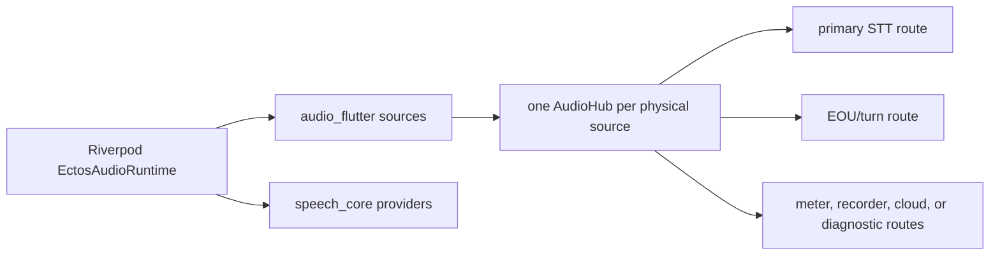

# Ectos migration

## Resulting boundary

The Flutter Ectos app now composes capture, routing, and speech independently:



`DefaultEctosAudioRuntime` is a hybrid composition selected from persisted app
settings. Live STT can use FluidAudio or Deepgram, batch STT can use FluidAudio
or MLX, and TTS can use FluidAudio, MLX, or OpenAI. FluidAudio currently
provides VAD and EOU. Only the selected MLX workers are allocated, and cloud
credentials come from renewable secure-store token sources.

Capture sources remain provider-neutral. Changing any provider leaves
`GraphLiveAudioBackend`/`GraphDictationAudioBackend` capture construction
unchanged. Provider-specific model profiles and typed options are translated
only inside the runtime.

## Implemented migration

1. Fluid streaming ASR now installs result listeners and explicitly starts its
   native engine before the first frame reaches it.
2. Live and dictation capture use prepare -> subscribe/attach -> start, so early
   PCM and health events are not lost.
3. `audio_flutter` owns microphone and system-audio sources. It forwards the
   selected input device UID, process IDs, permission checks, health events,
   and source-native recording paths.
4. Live microphone and system capture each own an independent `AudioHub`.
   Primary STT and EOU are lossless/fail-loud routes. App-provided optional
   branches are attached through `LiveAudioRouteSpec` with their own explicit
   mailbox policy.
5. Dictation capture uses the same source/hub contract. Captured PCM is passed
   as a finite `BufferedAudioSource` to `BatchSpeechToTextProvider`.
6. `GraphLiveAudioBackend` and `GraphDictationAudioBackend` are the app
   defaults. Riverpod composes the runtime and optional routes; no Riverpod type
   crosses into Audio Kit.
7. The transcript reducer, question detection, and the dictation state machine
   have moved out of the app into `conversation_core`. That layer was never
   provider-specific — it reads transcripts, not audio — and keeping it in the
   app made it unreusable rather than decoupled. `conversation_core` and
   `turn_detection` live in the sibling
   [conversation-kit-dart](https://github.com/kshdotdev/conversation-kit-dart)
   repository, not in this workspace. `conversation_core` is pure
   Dart over `speech_core` and `turn_detection`: `LiveTranscriptStore`,
   `UtteranceSegmenter`, `QuestionGate`, `ClassifierChain` (over a
   host-neutral `QuestionDetectorStrategy`), `AutoFirePolicy`,
   `QuestionDetectionCoordinator`, `QuestionDetectionPrompts` with the
   transcript fence, and `DictationManager` behind a `DictationHost` seam.
   What stays in the app is what is genuinely app-shaped: the Riverpod
   providers and notifier wrappers, the settings enums (mapped onto the
   package's neutral ones), formatting commands, recording paths, permission
   prompts and text injection, `dictation_audio_backend.dart`, the live
   transcription engine, and the LLM-provider classifier binding. Each moved
   file left a re-export shim at its old path, so no Riverpod type crosses into
   Audio Kit and no app call site had to move with it.
8. The FluidAudio CocoaPods version matches the plugin version, and the
   concrete-backend app tests exercise the graph-backed default rather than
   relying only on feature fakes.
9. Persisted provider selections rebuild only the speech runtime projection;
   unrelated UI settings do not unload models. Dictation also invalidates its
   cached recognizer when the selected runtime changes.
10. `GraphVoiceInput` shares one microphone capture between selected STT and
    VAD. `GraphVoiceSpeechOutput` routes any selected TTS source into Darwin
    playback and optional bounded sibling routes.

The app still exposes some compatibility types with historical Fluid names
(`FluidTranscriptionUpdate`, `FluidCaptureHealth`, and related backend seams).
They are app-edge values, not provider types inside Audio Kit. Renaming those
types can be done separately without changing the graph.

## Recording choices

Ectos currently forwards meeting and dictation recording paths to
`audio_flutter` for source-native WAV recording. This preserves the native
capture format and forces fail-capture semantics if the pre-conversion queue
cannot keep up.

An app route that needs the graph's session format can instead attach
`WavFileAudioSink` from:

```dart
import 'package:audio_processing/audio_processing_io.dart';
```

That generic route is bounded by normal graph policy and finalizes or removes a
partial file according to its abort policy.

## Provider swaps

### FluidAudio to Deepgram for live STT

Set `AppSettings.streamingSpeechProvider` to `deepgram`. The composed runtime
selects `DeepgramSpeechToTextProvider` and maps
`DeepgramStreamingOptions`. The existing `FlutterAudioCaptureSource`,
`AudioHub`, lossless primary route, health wiring, and transcript reducer stay
unchanged.

Deepgram credentials come from a renewable `DeepgramTokenSource`; the provider
does not capture audio itself.

### FluidAudio to MLX for dictation

Set `AppSettings.batchSpeechProvider` to `mlx`. The runtime creates a
long-lived `MlxIsolateBatchWorker`; dictation's finite `BufferedAudioSource`
and `BatchRecognitionRequest` remain unchanged.

MLX does not implement streaming STT. A future live-MLX runtime must add VAD and
bounded utterance accumulation before calling batch recognition; it must not
pretend that batch inference is a streaming sink.

### TTS

FluidAudio, configured MLX, and OpenAI all implement
`TextToSpeechProvider`. Their result is an `AudioSource`, so the same synthesis
can branch through the graph to playback, a WAV sink, recording, or analysis.
MLX emits incremental model PCM from a worker isolate; OpenAI decodes the
streamed HTTP body incrementally.

## Compatibility window

`fluidaudio_dart` remains focused on inference and keeps its original
`FluidMicrophone`/`FluidSystemAudio` APIs as 0.x compatibility surfaces.
New production composition should use `audio_flutter`.

The old `FluidAudioBackend` remains available to Ectos tests and transitional
callers. The production providers select the graph backends.

## Portability acceptance

A provider swap is successful when:

- source creation and `AudioHub` code do not change;
- no provider SDK type escapes an adapter/runtime mapping;
- every route and provider write queue is bounded;
- a streaming provider sees continuous frames or the route fails loudly;
- batch providers receive a finite source with an explicit input limit;
- stop, failure, and cancellation finalize lossless recordings correctly;
- mic and system tracks remain independent unless a synchronizer is explicitly
  composed.

See [validation](validation.md) for the default and opt-in checks.
